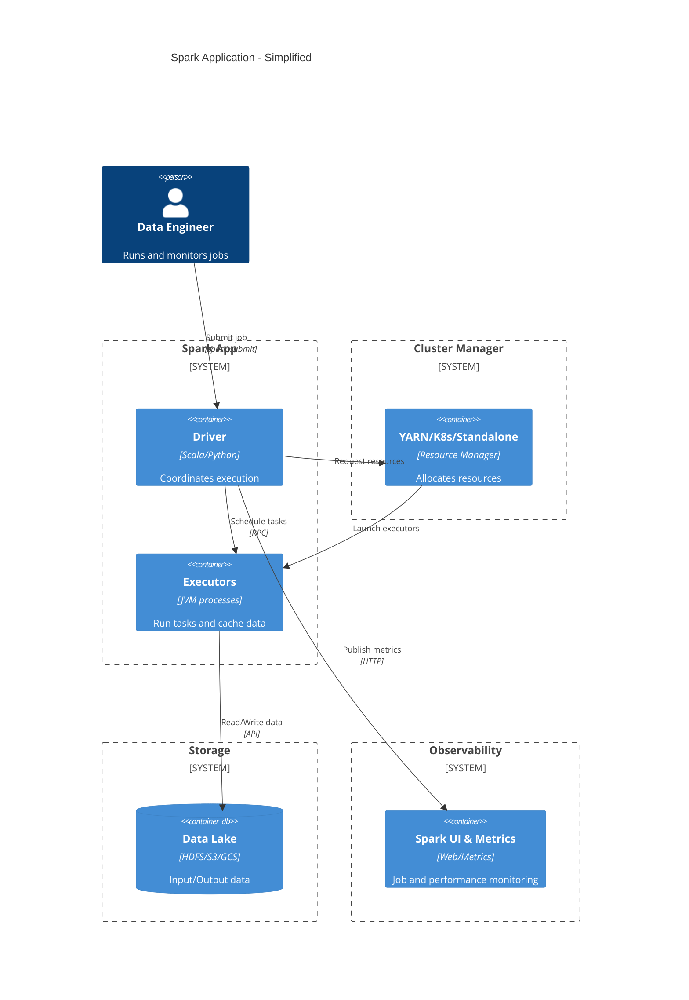
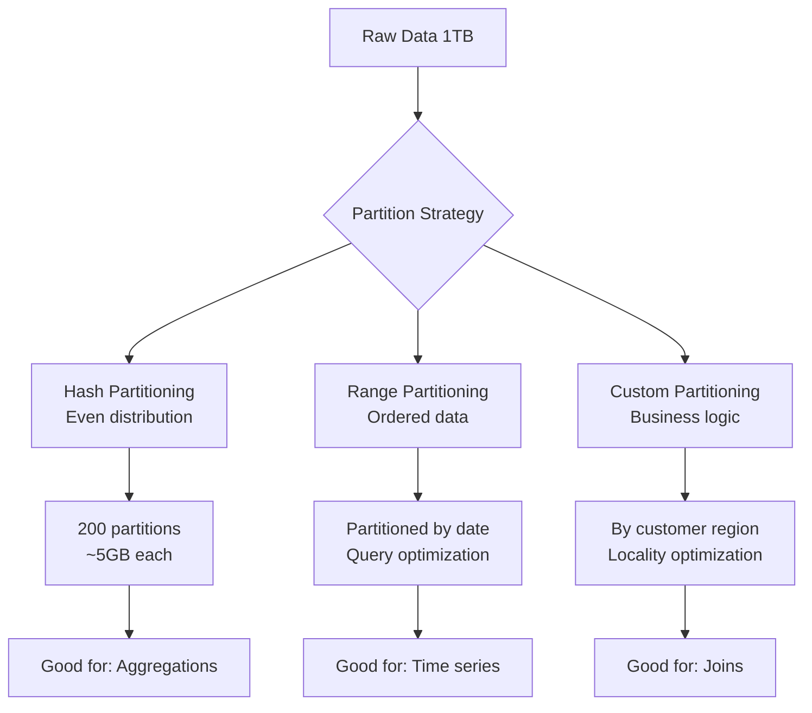

# Spark Architecture & Core Concepts for Production Systems ⚙️

## Building Distributed Data Processing Systems That Scale and Control Costs


*Figure: High-level Spark cluster architecture (driver, executors, cluster resources, data storage).*

**Tags**: apache-spark, pyspark, distributed-computing, architecture, production-systems, cost-optimization, performance-tuning, data-engineering

---

## TL;DR 📋

- Master Spark's driver-executor architecture and understand when distributed processing adds value vs overhead
- Choose the right cluster manager (YARN, Kubernetes, Standalone) based on your infrastructure and cost constraints  
- Implement memory management and resource allocation strategies that prevent OOM errors and optimize costs
- Design partitioning strategies that minimize shuffles and maximize parallelism for your specific workloads
- Establish monitoring and observability patterns that catch performance issues before they impact production

---

## Who This Is For 👥

**Target Audience**: Senior data engineers, platform engineers, and technical leads working with large-scale data transformation pipelines (100GB+ datasets).

**Prerequisites**: 
- Strong SQL and Python experience
- Basic understanding of distributed systems concepts
- Familiarity with cloud computing resources (CPU, memory, storage)
- Experience with data warehouses or data lakes

---

## Learning Objectives 🎯

- Understand Spark's architecture trade-offs and when to choose it over alternatives like cloud data warehouses
- Design resource allocation strategies that balance performance and cost for your specific workloads  
- Implement partitioning and data organization patterns that minimize expensive shuffle operations
- Configure monitoring and alerting for production Spark applications
- Choose the optimal cluster manager and deployment pattern for your infrastructure constraints
- Apply memory management techniques that prevent common production failures

---

## Table of Contents 📚

1. [The Mental Model: Why Distributed Processing? 🧠](#mental-model)
2. [When Spark Makes Sense (And When It Doesn't) ⚖️](#when-spark-makes-sense)
3. [Architecture Deep Dive: Driver, Executors, and Cluster Managers 🏗️](#architecture-deep-dive)
4. [Memory Management and Resource Allocation 💾](#memory-management)
5. [Data Organization and Partitioning Strategies 📂](#data-organization)
6. [Implementation: Setting Up Production-Ready Spark 🛠️](#implementation)
7. [Monitoring and Observability Patterns 📊](#monitoring)
8. [Cost Optimization Strategies 💰](#cost-optimization)
9. [Security and Compliance Considerations 🔒](#security-compliance)
10. [Production Checklist ✅](#production-checklist)

---

## The Mental Model: Why Distributed Processing? 🧠

Think of Spark like a construction crew building a skyscraper. A single worker (traditional single-machine processing) can build a house efficiently, but for a skyscraper, you need coordination between multiple specialized workers (executors) managed by a foreman (driver).

The key insight: **distributed processing shines when the coordination overhead is justified by the parallelization benefits**. This typically happens when:

- Your data exceeds single-machine memory (>100GB active datasets)
- Processing time on a single machine exceeds acceptable SLAs  
- You need fault tolerance for long-running transformations
- Cost optimization requires elastic scaling based on workload

### The Coordination Tax 💸

Every distributed system pays a "coordination tax" in the form of:
- Network I/O between nodes
- Serialization/deserialization overhead  
- Cluster management complexity
- Resource provisioning time

Understanding this tax helps you make better architectural decisions.


*Caption: Complete Spark application architecture showing driver-executor coordination and cluster integration*
*Alt: Diagram shows data engineer submitting jobs to Spark driver, which coordinates with cluster manager to launch executors that process data from distributed storage*

[Export this Mermaid to PNG and insert here]

---

## When Spark Makes Sense (And When It Doesn't) ⚖️

### Spark Excels When: ✅

**Large-scale ETL with complex transformations**
```python
# Example: Processing 500GB of transaction data with complex aggregations
daily_txns = spark.read.parquet("s3://data-lake/transactions/2024/")
complex_metrics = daily_txns.groupBy("merchant_id", "category") \
    .agg(
        sum("amount").alias("total_revenue"),
        countDistinct("customer_id").alias("unique_customers"),
        percentile_approx("amount", 0.95).alias("p95_transaction")
    )
```

**Multi-format data integration**
- Joining structured data (Parquet) with semi-structured (JSON) and streaming data
- Complex data quality rules that require custom UDFs
- Machine learning feature engineering at scale

**Cost-sensitive batch processing**
- Workloads that can tolerate 10-30 minute startup time for spot instance savings
- Peak/off-peak processing with significant cost differences

### Consider Alternatives When: ❌

**Small datasets (<10GB)**
- Cloud data warehouse native processing (BigQuery, Snowflake) often faster and simpler
- Pandas + cloud functions for ad-hoc analysis

**Real-time requirements (<1 minute latency)**
- Streaming platforms like Kafka Streams or Flink better suited
- Cloud pub/sub with serverless functions

**Simple aggregations on structured data**
- Modern data warehouses optimize these queries better than general-purpose engines

### Decision Matrix 📊

| Use Case | Data Size | Complexity | Latency Req | Recommendation |
|----------|-----------|------------|------------|----------------|
| Daily aggregations | <50GB | Low | Hours | Cloud DW |
| ETL with UDFs | >100GB | High | Hours | Spark |
| Real-time alerts | Any | Medium | <1min | Streaming |
| ML feature prep | >50GB | High | Hours | Spark |

---

## Architecture Deep Dive: Driver, Executors, and Cluster Managers 🏗️

### Driver Program: The Orchestrator 🎭

The driver is your application's control center. It:
- Maintains the SparkContext and coordinates all operations
- Converts your high-level transformations into a DAG of stages
- Schedules tasks across executors
- Collects results and handles failures

**Critical insight**: The driver is a single point of failure. If it goes down, your entire application fails.

```python
# Driver configuration for large datasets
spark = SparkSession.builder \
    .appName("ProductionETL") \
    .config("spark.driver.memory", "8g") \
    .config("spark.driver.maxResultSize", "2g") \
    .config("spark.sql.adaptive.enabled", "true") \
    .getOrCreate()
```

### Executors: The Workers 👷

Executors run on worker nodes and:
- Execute tasks sent by the driver
- Store data in memory and disk cache
- Report computation results and metrics back to driver

**Key configuration principles**:
- Each executor should have 2-5 CPU cores (sweet spot for parallelism vs overhead)
- Memory should be sized to handle your largest partition comfortably
- Too many small executors = coordination overhead
- Too few large executors = resource underutilization

### Cluster Managers: The Resource Brokers 🏢

**YARN (Hadoop ecosystem)**
```bash
# Production YARN submission
spark-submit \
  --master yarn \
  --deploy-mode cluster \
  --executor-memory 4g \
  --executor-cores 4 \
  --num-executors 10 \
  --driver-memory 2g \
  --queue production \
  my_etl_job.py
```

**Kubernetes (Cloud-native)**
```yaml
# k8s executor pod template
apiVersion: v1
kind: Pod
spec:
  containers:
  - name: spark-executor
    resources:
      requests:
        memory: "4Gi"
        cpu: "2"
      limits:
        memory: "4Gi" 
        cpu: "2"
    env:
    - name: SPARK_EXECUTOR_MEMORY
      value: "3g"
```

**Standalone (Simple clusters)**
- Good for proof-of-concepts and small teams
- Less resource isolation and management features
- Easier setup but limited production features

### Cluster Manager Trade-offs

| Manager | Pros | Cons | Best For |
|---------|------|------|----------|
| YARN | Mature, resource isolation, multi-tenancy | Complex setup, legacy feel | Hadoop ecosystems |
| Kubernetes | Cloud-native, flexible, container benefits | Learning curve, newer | Modern cloud infrastructure |
| Standalone | Simple, fast startup | Limited features, less isolation | Development, small clusters |

---

## Memory Management and Resource Allocation 💾

### Spark Memory Model 🧠

Spark divides executor memory into regions:
- **Storage (60% default)**: Cached DataFrames and broadcast variables
- **Execution (40% default)**: Shuffles, joins, sorts, aggregations  
- **User Memory (~300MB)**: User data structures, metadata
- **Reserved Memory (~300MB)**: Spark internal objects

```python
# Memory tuning for large datasets
spark.conf.set("spark.sql.adaptive.coalescePartitions.enabled", "true")
spark.conf.set("spark.sql.adaptive.advisoryPartitionSizeInBytes", "256MB")
spark.conf.set("spark.sql.adaptive.skewJoin.enabled", "true")

# Prevent OOM during wide transformations
spark.conf.set("spark.sql.adaptive.maxShuffledHashJoinLocalMapThreshold", "0")
```

### Resource Allocation Strategies 🎯

**Strategy 1: Maximize Data Locality**
```python
# Configure for data locality when reading from HDFS/S3
spark.conf.set("spark.locality.wait", "3s")
spark.conf.set("spark.sql.files.maxPartitionBytes", "128MB")
```

**Strategy 2: Optimize for Memory-Intensive Workloads**
```python
# Increase storage fraction for caching-heavy jobs
spark.conf.set("spark.sql.adaptive.enabled", "true")
spark.conf.set("spark.sql.adaptive.coalescePartitions.enabled", "true")
```

### Common Memory Issues and Solutions 🚨

**OutOfMemoryError: Java heap space**
```python
# Solution: Increase executor memory or reduce partition size
spark.conf.set("spark.executor.memory", "8g")
spark.conf.set("spark.sql.files.maxPartitionBytes", "64MB")
```

**OutOfMemoryError: Unable to acquire memory for broadcast**
```python
# Solution: Increase driver memory or disable broadcast joins
spark.conf.set("spark.driver.memory", "4g")
spark.conf.set("spark.sql.autoBroadcastJoinThreshold", "-1")  # Disable
```

---

## Data Organization and Partitioning Strategies 📂

Partitioning is the most important factor for Spark performance. Poor partitioning leads to:
- Data skew (some executors overloaded)
- Excessive shuffling (network-intensive operations)
- Underutilized cluster resources

### Partitioning Strategies 📊


*Caption: Different partitioning strategies and their optimal use cases*
*Alt: Flowchart showing how raw data can be partitioned using hash, range, or custom strategies based on use case*

[Export this Mermaid to PNG and insert here]

### Optimal Partition Sizing 📏

**Rule of thumb**: 128-256MB per partition
- Smaller partitions = more parallelism but higher overhead
- Larger partitions = less overhead but potential memory issues

```python
# Calculate optimal partition count
def calculate_partitions(data_size_gb, target_partition_mb=128):
    """
    Calculate optimal partition count based on data size
    """
    return max(1, int((data_size_gb * 1024) / target_partition_mb))

# Example: 500GB dataset
optimal_partitions = calculate_partitions(500)  # ~4000 partitions
```

### Data Layout Optimization 🗂️

**Columnar Storage Benefits**
```python
# Write optimized Parquet with proper partitioning
df.write \
  .mode("overwrite") \
  .partitionBy("date_partition", "region") \
  .option("compression", "snappy") \
  .parquet("s3://data-lake/transactions/")
```

**Z-ordering for Query Performance** (Delta Lake)
```python
from delta.tables import DeltaTable

# Optimize table layout for common query patterns
DeltaTable.forPath(spark, "s3://data-lake/transactions/") \
  .optimize() \
  .executeZOrderBy("customer_id", "transaction_date")
```

---

## Implementation: Setting Up Production-Ready Spark 🛠️

### Environment Setup 🏗️

```bash
# Production Spark installation
wget https://archive.apache.org/dist/spark/spark-3.4.1/spark-3.4.1-bin-hadoop3.tgz
tar -xzf spark-3.4.1-bin-hadoop3.tgz
export SPARK_HOME=/opt/spark-3.4.1-bin-hadoop3
export PATH=$PATH:$SPARK_HOME/bin
```

### Minimal Production Configuration 📝

```python
# production_config.py
import os
from pyspark.sql import SparkSession

def create_spark_session(app_name: str) -> SparkSession:
    """
    Create production-ready Spark session with optimized defaults
    """
    return SparkSession.builder \
        .appName(app_name) \
        .config("spark.sql.adaptive.enabled", "true") \
        .config("spark.sql.adaptive.coalescePartitions.enabled", "true") \
        .config("spark.sql.adaptive.advisoryPartitionSizeInBytes", "256MB") \
        .config("spark.sql.execution.arrow.pyspark.enabled", "true") \
        .config("spark.serializer", "org.apache.spark.serializer.KryoSerializer") \
        .config("spark.sql.parquet.compression.codec", "snappy") \
        .config("spark.sql.session.timeZone", "UTC") \
        .getOrCreate()

# Example usage
spark = create_spark_session("ProductionETL")
```

### Sample Data Pipeline 🔄

```python
# production_pipeline.py
from pyspark.sql import functions as F
from pyspark.sql.types import *

def process_transactions(spark, input_path: str, output_path: str):
    """
    Production ETL pipeline with error handling and optimizations
    """
    
    # Read with schema enforcement
    schema = StructType([
        StructField("transaction_id", StringType(), False),
        StructField("customer_id", StringType(), False),
        StructField("amount", DoubleType(), False),
        StructField("transaction_date", DateType(), False),
        StructField("merchant_category", StringType(), True)
    ])
    
    # Read and validate data
    raw_df = spark.read \
        .schema(schema) \
        .option("multiline", "true") \
        .json(input_path)
    
    # Data quality checks
    initial_count = raw_df.count() 
    clean_df = raw_df.filter(
        (F.col("amount") > 0) & 
        (F.col("customer_id").isNotNull()) &
        (F.col("transaction_date").isNotNull())
    )
    
    final_count = clean_df.count()
    data_quality_ratio = final_count / initial_count
    
    if data_quality_ratio < 0.95:
        raise ValueError(f"Data quality check failed: {data_quality_ratio:.2%} valid records")
    
    # Business transformations
    enriched_df = clean_df \
        .withColumn("transaction_month", F.date_trunc("month", "transaction_date")) \
        .withColumn("amount_bucket", 
            F.when(F.col("amount") < 50, "small")
            .when(F.col("amount") < 200, "medium") 
            .otherwise("large"))
    
    # Write with partitioning
    enriched_df.write \
        .mode("overwrite") \
        .partitionBy("transaction_month", "merchant_category") \
        .parquet(output_path)
    
    return {
        "input_records": initial_count,
        "output_records": final_count,
        "data_quality_ratio": data_quality_ratio
    }

# Example dataset (inline for testing)
sample_data = [
    ("tx_001", "cust_123", 75.50, "2024-01-15", "grocery"),
    ("tx_002", "cust_456", 250.00, "2024-01-15", "electronics"), 
    ("tx_003", "cust_789", 15.25, "2024-01-16", "food"),
]

if __name__ == "__main__":
    spark = create_spark_session("TestPipeline")
    
    # Create test dataset  
    test_df = spark.createDataFrame(sample_data, 
        ["transaction_id", "customer_id", "amount", "transaction_date", "merchant_category"])
    
    # Process sample data
    result = process_transactions(spark, "test_input", "test_output")
    print(f"Pipeline completed: {result}")
```

### Expected Output 📊
```json
{
  "input_records": 3,
  "output_records": 3, 
  "data_quality_ratio": 1.0
}
```

---

## Monitoring and Observability Patterns 📊

### Essential Metrics to Track 📈

**Application-Level Metrics**
```python
# Custom metrics collection
def collect_job_metrics(spark_context):
    """
    Collect key performance metrics during job execution
    """
    metrics = {
        "total_tasks": spark_context.statusTracker().getJobIdsForGroup(None),
        "active_stages": len(spark_context.statusTracker().getActiveStageIds()),
        "executor_infos": spark_context.statusTracker().getExecutorInfos()
    }
    return metrics
```

**Infrastructure Metrics** 
- CPU utilization per executor
- Memory usage (heap + off-heap)
- Disk I/O patterns
- Network throughput
- GC pressure and frequency

### Spark UI Analysis 🔍

Critical areas to monitor:
1. **Jobs tab**: Failed tasks, task distribution
2. **Stages tab**: Shuffle read/write, spill metrics
3. **Storage tab**: Cached DataFrame memory usage
4. **Executors tab**: Resource utilization, GC time
5. **SQL tab**: Query plans, execution time

### Alerting Strategy 🚨

```python
# alerting_config.py
class SparkJobMonitor:
    def __init__(self, spark_context):
        self.sc = spark_context
        
    def check_job_health(self):
        """
        Implement health checks for production jobs
        """
        warnings = []
        
        # Check for task failures
        failed_tasks = sum(stage.numFailedTasks for stage in 
                          self.sc.statusTracker().getActiveStageInfos())
        if failed_tasks > 0:
            warnings.append(f"Failed tasks detected: {failed_tasks}")
            
        # Check for executor failures  
        active_executors = len([e for e in self.sc.statusTracker().getExecutorInfos() 
                               if e.isActive])
        if active_executors < 2:
            warnings.append(f"Low executor count: {active_executors}")
            
        return warnings
```

---

## Cost Optimization Strategies 💰

### Compute Cost Optimization 💸

**Spot Instance Strategy**
```python
# EMR spot instance configuration
{
    "InstanceGroups": [
        {
            "Name": "Master",
            "Market": "ON_DEMAND", 
            "InstanceRole": "MASTER",
            "InstanceType": "m5.xlarge",
            "InstanceCount": 1
        },
        {
            "Name": "Workers", 
            "Market": "SPOT",
            "InstanceRole": "CORE", 
            "InstanceType": "m5.2xlarge",
            "InstanceCount": 10,
            "BidPrice": "0.15"  # ~60% savings
        }
    ]
}
```

**Auto-scaling Configuration**
```yaml
# Kubernetes HPA for Spark executors
apiVersion: autoscaling/v2
kind: HorizontalPodAutoscaler
metadata:
  name: spark-executor-hpa
spec:
  scaleTargetRef:
    apiVersion: apps/v1
    kind: Deployment
    name: spark-executor
  minReplicas: 2
  maxReplicas: 50
  metrics:
  - type: Resource
    resource:
      name: cpu
      target:
        type: Utilization
        averageUtilization: 70
```

### Storage Cost Optimization 💾

**Data Lifecycle Management**
```python
# Optimize storage costs with tiered storage
def optimize_data_storage(df, base_path: str):
    """
    Implement storage tiering based on data age
    """
    current_date = F.current_date()
    
    # Hot data (last 30 days) - high performance storage
    hot_data = df.filter(F.datediff(current_date, "date_partition") <= 30)
    hot_data.write.parquet(f"{base_path}/hot/")
    
    # Warm data (30-365 days) - standard storage  
    warm_data = df.filter(
        (F.datediff(current_date, "date_partition") > 30) & 
        (F.datediff(current_date, "date_partition") <= 365)
    )
    warm_data.write.option("compression", "gzip").parquet(f"{base_path}/warm/")
    
    # Cold data (>365 days) - archive storage
    cold_data = df.filter(F.datediff(current_date, "date_partition") > 365)
    cold_data.coalesce(1).write.option("compression", "gzip").parquet(f"{base_path}/cold/")
```

### Cost Monitoring Dashboard 📊

```python
# cost_monitoring.py
class CostTracker:
    def __init__(self):
        self.metrics = {}
        
    def calculate_job_cost(self, runtime_hours: float, instance_type: str, num_instances: int):
        """
        Estimate job costs based on runtime and resources
        """
        # AWS EC2 pricing (example)
        instance_costs = {
            "m5.xlarge": 0.192,    # $/hour
            "m5.2xlarge": 0.384,
            "m5.4xlarge": 0.768
        }
        
        compute_cost = runtime_hours * instance_costs[instance_type] * num_instances
        
        # Add storage costs (simplified)
        storage_cost = runtime_hours * 0.023 * num_instances  # EBS cost
        
        return {
            "compute_cost": compute_cost,
            "storage_cost": storage_cost, 
            "total_cost": compute_cost + storage_cost
        }
```

---

## Security and Compliance Considerations 🔒

### Data Encryption 🔐

```python
# Enable encryption at rest and in transit
spark.conf.set("spark.sql.execution.arrow.pyspark.enabled", "true")
spark.conf.set("spark.authenticate", "true")
spark.conf.set("spark.network.crypto.enabled", "true")
spark.conf.set("spark.io.encryption.enabled", "true")

# S3 encryption configuration
spark.conf.set("spark.hadoop.fs.s3a.server-side-encryption-algorithm", "AES256")
```

### Access Control 🚪

```python
# Role-based access control example
def create_secure_session(user_role: str) -> SparkSession:
    """
    Create Spark session with role-based security
    """
    base_config = SparkSession.builder.appName("SecureApp")
    
    if user_role == "analyst":
        # Limited access configuration
        return base_config \
            .config("spark.sql.warehouse.dir", "/data/analyst_workspace") \
            .config("spark.sql.execution.allowedDatabases", "analytics,staging") \
            .getOrCreate()
    elif user_role == "admin":
        # Full access configuration  
        return base_config \
            .config("spark.sql.warehouse.dir", "/data/admin_workspace") \
            .getOrCreate()
    else:
        raise ValueError(f"Unknown role: {user_role}")
```

### Compliance Patterns 📋

**Data Masking for PII**
```python
from pyspark.sql.functions import sha2, regexp_replace

def mask_sensitive_data(df):
    """
    Apply data masking for compliance
    """
    return df \
        .withColumn("customer_id_hash", sha2("customer_id", 256)) \
        .withColumn("email_masked", 
            regexp_replace("email", r"(.{2})[^@]*(@.*)", r"$1***$2")) \
        .drop("customer_id", "email")
```

---

## Production Checklist ✅

### Pre-Deployment Validation ✅

- [ ] **Resource Planning**
  - [ ] Cluster sizing based on data volume projections
  - [ ] Memory allocation prevents OOM scenarios  
  - [ ] Network bandwidth sufficient for shuffle operations
  - [ ] Storage capacity planning with 20% buffer

- [ ] **Configuration Review**
  - [ ] Adaptive Query Execution enabled
  - [ ] Appropriate serialization format (Kryo)
  - [ ] Timezone handling (UTC recommended)
  - [ ] Logging level optimized for production

- [ ] **Security Hardening**
  - [ ] Authentication enabled
  - [ ] Encryption in transit and at rest
  - [ ] Network security groups configured
  - [ ] Access control policies validated

### Monitoring and Alerting ✅

- [ ] **Essential Metrics**
  - [ ] Job success/failure rates
  - [ ] Task completion times and failures
  - [ ] Memory and CPU utilization
  - [ ] Data quality metrics

- [ ] **Alert Configuration**
  - [ ] Job failure notifications
  - [ ] Resource exhaustion warnings
  - [ ] Data quality threshold breaches
  - [ ] Cost budget alerts

### Operational Procedures ✅

- [ ] **Runbooks Prepared**
  - [ ] Common failure scenarios and remediation
  - [ ] Scaling procedures for peak loads
  - [ ] Data recovery processes
  - [ ] Performance troubleshooting guide

- [ ] **Testing Strategy**
  - [ ] Unit tests for transformation logic
  - [ ] Integration tests with realistic data volumes
  - [ ] Performance regression tests
  - [ ] Disaster recovery validation

---

## Recap and What's Next 🚀

In this first part, we've established the foundational knowledge for production Spark systems:

**Key Takeaways**:
- Spark excels at complex transformations on large datasets but comes with coordination overhead
- Architecture decisions (cluster manager, resource allocation) significantly impact both performance and cost
- Proper partitioning and memory management prevent the majority of production issues
- Monitoring and cost optimization are essential for sustainable operations

**In Part 2**, we'll dive deep into advanced DataFrame operations and query optimization techniques, including:
- Catalyst optimizer internals and how to work with it
- Advanced join strategies and broadcast optimizations  
- Window functions and complex aggregation patterns
- Query plan analysis and performance tuning

The combination of solid architectural foundations (Part 1) with advanced optimization techniques (Part 2) will give you the tools to build Spark systems that scale efficiently and control costs effectively.

---

## References and Further Reading 📚

- [Apache Spark Official Documentation](https://spark.apache.org/docs/latest/) - Comprehensive reference
- [Spark SQL Performance Tuning](https://spark.apache.org/docs/latest/sql-performance-tuning.html) - Official optimization guide
- [High Performance Spark (O'Reilly)](https://www.oreilly.com/library/view/high-performance-spark/9781491943199/) - Advanced patterns and techniques
- [Databricks Performance Tuning Guide](https://docs.databricks.com/optimizations/index.html) - Cloud-specific optimizations
- [EMR Best Practices](https://docs.aws.amazon.com/emr/latest/ManagementGuide/emr-plan-instances-guidelines.html) - AWS deployment patterns
- [Kubernetes Spark Operator](https://github.com/GoogleCloudPlatform/spark-on-k8s-operator) - Cloud-native deployments

---

## What to Read Next 📖

1. **[Part 2: Advanced DataFrame Operations & Query Optimization](./02-advanced-dataframe-operations-query-optimization.md)** - Master complex transformations and Catalyst optimizer
2. **(WIP)[Spark Performance Tuning Cookbook](./03-spark-performance-tuning-cookbook.md)** - Practical recipes for common optimization scenarios  
3. **(WIP)[Building Data Pipelines with Apache Airflow](../apache-airflow/01-building-data-pipelines-with-apache-airflow.md)** - Orchestration patterns for production Spark jobs  
4. **(WIP)[Delta Lake Guide](../delta-lake/01-delta-lake-guide.md)** - Modern data lake architecture with Spark integration  
5. **(WIP)[Monitoring Distributed Systems](../observability/01-monitoring-distributed-systems.md)** - Observability patterns for data engineering platforms

---

## Assumptions Made 📝

1. **Infrastructure Assumption**: Readers have access to cloud infrastructure (AWS/GCP/Azure) or on-premises Hadoop clusters for testing production configurations.

2. **Scale Assumption**: Examples are optimized for datasets in the 100GB-10TB range, which represents the sweet spot for Spark adoption in most enterprises.

---

*Next in series: [Part 2: Advanced DataFrame Operations & Query Optimization 📊](./02-advanced-dataframe-operations-query-optimization.md)*
