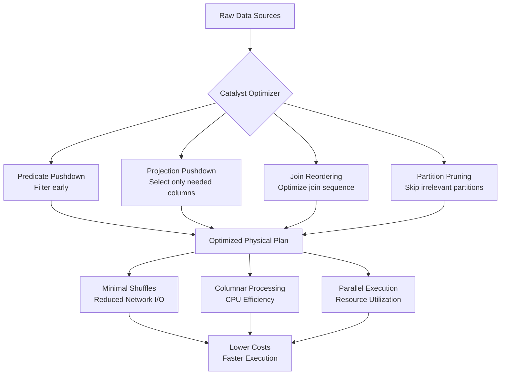
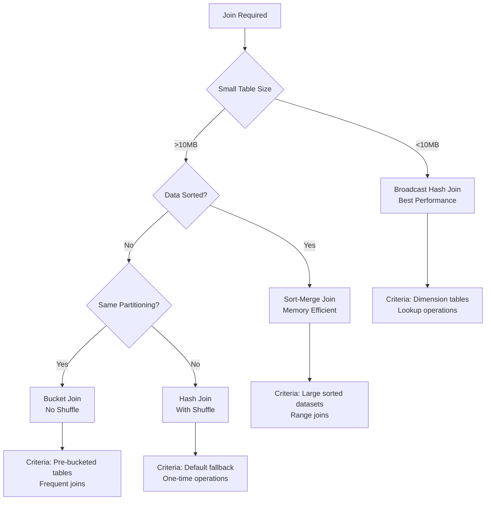

# Advanced DataFrame Operations & Query Optimization 📊

## Master Complex Transformations and Catalyst Optimizer for Production Performance

## TL;DR 📋

- Master advanced DataFrame transformations including complex joins, window functions, and custom aggregations that scale to production workloads
- Understand Catalyst optimizer internals to write queries that generate optimal execution plans and minimize compute costs
- Implement bucketing and Z-ordering strategies that dramatically reduce shuffle operations and query latency
- Apply broadcast join optimizations and predicate pushdown techniques that can improve performance by 10x or more
- Design schema evolution and data quality patterns that prevent pipeline failures in production environments

---

## Who This Is For 👥

**Target Audience**: Senior data engineers and analytics engineers building complex transformation pipelines that process 100GB+ datasets with strict SLA requirements.

**Prerequisites**: 
- Completed Part 1 or equivalent Spark architecture knowledge
- Strong SQL experience with complex joins and window functions
- Understanding of distributed computing concepts (partitioning, shuffling)
- Experience with data pipeline performance issues and optimization

---

## Learning Objectives 🎯

- Design complex DataFrame operations that minimize expensive shuffle operations and maximize parallelism
- Leverage Catalyst optimizer features to automatically optimize query execution plans for your specific workloads
- Implement advanced join strategies including broadcast, sort-merge, and bucket joins with clear decision criteria
- Apply window functions and complex aggregations efficiently for time-series and analytical workloads
- Build robust data quality and schema evolution patterns that prevent production pipeline failures
- Configure columnar storage optimizations that reduce both storage costs and query latency

---

## Table of Contents 📚

1. [Mental Model: Query Optimization as Cost Reduction 🧠](#mental-model)
2. [Catalyst Optimizer: Your Performance Partner 🔧](#catalyst-optimizer)
3. [Advanced Join Strategies & Performance Trade-offs ⚡](#join-strategies)
4. [Window Functions and Complex Aggregations at Scale 📈](#window-functions)
5. [Schema Evolution and Data Quality Patterns 🛡️](#schema-evolution)
6. [Implementation: Production-Grade Query Optimization 🛠️](#implementation)
7. [Bucketing and Z-Ordering for Query Performance 🗂️](#bucketing-z-ordering)
8. [Performance Testing and Benchmarking 📊](#performance-testing)
9. [Cost Impact Analysis and Monitoring 💰](#cost-analysis)
10. [Production Optimization Checklist ✅](#optimization-checklist)

---

## Mental Model: Query Optimization as Cost Reduction 🧠

Think of Spark query optimization like optimizing a supply chain. Raw materials (your data) need to flow through various processing stations (transformations) to create finished products (results). The Catalyst optimizer is your logistics coordinator, finding the most efficient routes and minimizing expensive transportation (shuffles).

**Key insight**: Every transformation has a "cost" in terms of:
- **Compute cost**: CPU cycles for processing
- **Network cost**: Data movement between nodes  
- **Storage cost**: Temporary data materialization
- **Time cost**: Pipeline execution latency

The goal is to minimize total cost while maintaining correctness.


*Caption: Catalyst optimizer transformations that reduce query execution costs*
*Alt: Flowchart showing how Catalyst optimizer applies various optimizations to reduce shuffle operations and improve performance*

[Export this Mermaid to PNG and insert here]

---

## Catalyst Optimizer: Your Performance Partner 🔧

### How Catalyst Works Internally 🔍

Catalyst operates in four phases:
1. **Logical Plan**: High-level operations from your DataFrame code
2. **Optimized Logical Plan**: Rule-based optimizations applied
3. **Physical Plans**: Multiple execution strategies generated
4. **Selected Physical Plan**: Cost-based optimizer chooses best strategy

```python
# Enable detailed query plan logging
spark.conf.set("spark.sql.adaptive.enabled", "true")
spark.conf.set("spark.sql.adaptive.coalescePartitions.enabled", "true")
spark.conf.set("spark.sql.planChangeLog.level", "INFO")

# Example: Complex query that benefits from Catalyst optimizations
from pyspark.sql import functions as F

# This query will be heavily optimized by Catalyst
result = orders_df.filter(F.col("order_date") >= "2024-01-01") \
    .join(customers_df.select("customer_id", "region"), "customer_id") \
    .groupBy("region") \
    .agg(F.sum("order_total").alias("revenue")) \
    .orderBy(F.desc("revenue"))

# View the optimized plan
result.explain(extended=True)
```

### Catalyst Optimization Rules 📋

**Rule-Based Optimizations** (always applied):
- **Predicate Pushdown**: Moves filters as early as possible
- **Projection Pushdown**: Eliminates unnecessary columns early
- **Constant Folding**: Evaluates constants at compile time
- **Boolean Expression Simplification**: Optimizes complex conditions

**Cost-Based Optimizations** (requires statistics):
- **Join Reordering**: Chooses optimal join sequence
- **Join Selection**: Picks best join algorithm (broadcast vs sort-merge)
- **Adaptive Query Execution**: Adjusts plan during execution

```python
# Enable cost-based optimization with statistics collection
spark.sql("ANALYZE TABLE orders COMPUTE STATISTICS FOR ALL COLUMNS")
spark.sql("ANALYZE TABLE customers COMPUTE STATISTICS FOR ALL COLUMNS")

# Force statistics refresh for better optimization
spark.conf.set("spark.sql.cbo.enabled", "true")
spark.conf.set("spark.sql.cbo.joinReorder.enabled", "true")
```

### Reading Query Plans Like a Pro 🔍

```python
# Sample query for plan analysis
df = spark.sql("""
    SELECT c.region, SUM(o.order_total) as revenue
    FROM orders o
    JOIN customers c ON o.customer_id = c.customer_id  
    WHERE o.order_date >= '2024-01-01'
    GROUP BY c.region
    ORDER BY revenue DESC
""")

# Analyze the plan
df.explain("formatted")
```

**Key Plan Elements to Look For**:
- **Exchange**: Indicates shuffle operations (expensive)
- **BroadcastHashJoin**: Good for small dimension tables
- **SortMergeJoin**: Used for large table joins
- **Filter**: Should appear early in the plan
- **Project**: Column selection optimizations

---

## Advanced Join Strategies & Performance Trade-offs ⚡

### Join Algorithm Decision Matrix 🎯


*Caption: Decision tree for choosing optimal join strategies based on data characteristics*
*Alt: Flowchart showing how to select join algorithms based on table size, sorting, and partitioning*

[Export this Mermaid to PNG and insert here]

### Broadcast Join Optimization 📡

**When to Use**: One table <10MB, frequently joined dimension data

```python
from pyspark.sql import functions as F
from pyspark.sql.functions import broadcast

# Example: Large orders table joining with small regions lookup
orders_df = spark.read.parquet("s3://data-lake/orders/")  # 500GB
regions_df = spark.read.parquet("s3://data-lake/regions/")  # 5MB

# Manual broadcast hint (explicit control)
result = orders_df.join(
    broadcast(regions_df),
    orders_df.region_code == regions_df.code
)

# Automatic broadcast (let Catalyst decide)
spark.conf.set("spark.sql.autoBroadcastJoinThreshold", "10MB")
result_auto = orders_df.join(regions_df, "region_code")

# Monitor broadcast efficiency
result.explain()  # Look for BroadcastHashJoin
```

### Sort-Merge Join for Large Tables 🔄

**When to Use**: Both tables large, data can be sorted by join keys

```python
# Pre-sort data for efficient sort-merge joins
orders_sorted = orders_df.repartition("customer_id").sortWithinPartitions("customer_id")
customers_sorted = customers_df.repartition("customer_id").sortWithinPartitions("customer_id")

# This will use SortMergeJoin automatically
customer_orders = orders_sorted.join(customers_sorted, "customer_id")
```

### Bucket Joins: The Performance Champion 🏆

**When to Use**: Frequently joined tables, can pre-partition data

```python
# Write data with bucketing for optimal join performance
orders_df.write \
    .mode("overwrite") \
    .bucketBy(200, "customer_id") \
    .sortBy("customer_id") \
    .saveAsTable("bucketed_orders")

customers_df.write \
    .mode("overwrite") \
    .bucketBy(200, "customer_id") \
    .sortBy("customer_id") \
    .saveAsTable("bucketed_customers")

# Bucket joins require no shuffle - massive performance gain
bucketed_join = spark.sql("""
    SELECT o.order_id, c.customer_name, o.order_total
    FROM bucketed_orders o
    JOIN bucketed_customers c ON o.customer_id = c.customer_id
""")
```

### Join Performance Comparison 📊

| Join Type | Shuffle Required | Memory Usage | Best For | Performance |
|-----------|------------------|--------------|----------|-------------|
| Broadcast | No | High (driver) | Small dimensions | Excellent |
| Bucket | No | Low | Frequent joins | Excellent |
| Sort-Merge | Yes | Medium | Large sorted data | Good |
| Hash | Yes | High | General purpose | Fair |

---

## Window Functions and Complex Aggregations at Scale 📈

### Efficient Window Function Patterns 🪟

Window functions are powerful but can be expensive if not optimized properly.

```python
from pyspark.sql.window import Window
from pyspark.sql import functions as F

# Sample dataset for window function examples
sample_sales_data = [
    ("2024-01-01", "Electronics", "Phones", 1000.0, "Store_A"),
    ("2024-01-01", "Electronics", "Laptops", 2000.0, "Store_A"),
    ("2024-01-02", "Electronics", "Phones", 1200.0, "Store_B"),
    ("2024-01-02", "Clothing", "Shirts", 500.0, "Store_A"),
    ("2024-01-03", "Electronics", "Phones", 900.0, "Store_A"),
]

sales_df = spark.createDataFrame(sample_sales_data, 
    ["date", "category", "product", "revenue", "store"])

# Optimize window functions with proper partitioning
window_spec = Window.partitionBy("category", "store") \
    .orderBy("date") \
    .rowsBetween(Window.unboundedPreceding, Window.currentRow)

# Multiple window functions in single pass (efficient)
result = sales_df.withColumn("running_total", F.sum("revenue").over(window_spec)) \
    .withColumn("avg_revenue", F.avg("revenue").over(window_spec)) \
    .withColumn("rank", F.rank().over(Window.partitionBy("category").orderBy(F.desc("revenue"))))

result.show()
```

### Expected Output 📊
```
+----------+-----------+-------+-------+-------+-------------+-----------+----+
|      date|   category|product|revenue|  store|running_total|avg_revenue|rank|
+----------+-----------+-------+-------+-------+-------------+-----------+----+
|2024-01-01|Electronics| Phones| 1000.0|Store_A|       1000.0|     1000.0|   3|
|2024-01-03|Electronics| Phones|  900.0|Store_A|       1900.0|      950.0|   4|
|2024-01-01|Electronics|Laptops| 2000.0|Store_A|       2000.0|     2000.0|   1|
|2024-01-02|Electronics| Phones| 1200.0|Store_B|       1200.0|     1200.0|   2|
|2024-01-02|   Clothing| Shirts|  500.0|Store_A|        500.0|      500.0|   1|
+----------+-----------+-------+-------+-------+-------------+-----------+----+
```

### Advanced Aggregation Patterns 🔢

```python
# Complex multi-level aggregations with optimization
def calculate_business_metrics(sales_df):
    """
    Calculate complex business metrics efficiently
    """
    
    # Use single aggregation pass for multiple metrics
    daily_metrics = sales_df.groupBy("date", "category") \
        .agg(
            F.sum("revenue").alias("total_revenue"),
            F.avg("revenue").alias("avg_revenue"),
            F.count("*").alias("transaction_count"),
            F.countDistinct("product").alias("unique_products"),
            F.percentile_approx("revenue", 0.95).alias("p95_revenue"),
            F.stddev("revenue").alias("revenue_stddev")
        )
    
    # Add derived metrics
    enhanced_metrics = daily_metrics \
        .withColumn("revenue_per_transaction", F.col("total_revenue") / F.col("transaction_count")) \
        .withColumn("revenue_category", 
            F.when(F.col("total_revenue") > 5000, "High")
            .when(F.col("total_revenue") > 2000, "Medium")
            .otherwise("Low")
        )
    
    return enhanced_metrics

# Apply the function
business_metrics = calculate_business_metrics(sales_df)
business_metrics.show(truncate=False)
```

### Window Function Performance Tips 🚀

**Do's**:
- Partition by high-cardinality columns to reduce partition size
- Combine multiple window functions with same partitioning
- Use `rowsBetween` instead of `rangeBetween` when possible
- Cache intermediate results for reuse

**Don'ts**:
- Avoid window functions over entire dataset (no partitioning)
- Don't use different partitioning schemes in same query
- Avoid mixing window functions with shuffling operations

---

## Schema Evolution and Data Quality Patterns 🛡️

### Robust Schema Evolution 📋

```python
from pyspark.sql.types import StructType, StructField, StringType, DoubleType, DateType
from pyspark.sql.functions import col, when, isnan, isnull

def create_evolving_schema_reader(base_path: str):
    """
    Handle schema evolution gracefully in production pipelines
    """
    
    # Define expected schema with optional fields
    base_schema = StructType([
        StructField("transaction_id", StringType(), False),
        StructField("customer_id", StringType(), False),
        StructField("amount", DoubleType(), False),
        StructField("transaction_date", DateType(), False),
        StructField("merchant_category", StringType(), True),  # Optional
        StructField("payment_method", StringType(), True),     # New field
        StructField("loyalty_discount", DoubleType(), True)    # New field
    ])
    
    # Read with schema merging and evolution handling
    df = spark.read \
        .option("mergeSchema", "true") \
        .option("enforceSchema", "false") \
        .schema(base_schema) \
        .parquet(base_path)
    
    # Handle missing columns gracefully
    evolved_df = df \
        .withColumn("payment_method", 
            when(col("payment_method").isNull(), "unknown")
            .otherwise(col("payment_method"))) \
        .withColumn("loyalty_discount",
            when(col("loyalty_discount").isNull(), 0.0)
            .otherwise(col("loyalty_discount")))
    
    return evolved_df

# Example usage with validation
def validate_data_quality(df, quality_threshold=0.95):
    """
    Comprehensive data quality validation
    """
    total_records = df.count()
    
    # Quality checks
    quality_metrics = {
        "total_records": total_records,
        "null_customer_ids": df.filter(col("customer_id").isNull()).count(),
        "negative_amounts": df.filter(col("amount") < 0).count(),
        "future_dates": df.filter(col("transaction_date") > F.current_date()).count(),
        "duplicate_transactions": total_records - df.dropDuplicates(["transaction_id"]).count()
    }
    
    # Calculate quality score
    quality_issues = sum([v for k, v in quality_metrics.items() if k != "total_records"])
    quality_score = 1 - (quality_issues / total_records)
    
    if quality_score < quality_threshold:
        raise ValueError(f"Data quality below threshold: {quality_score:.2%}")
    
    return quality_metrics, quality_score
```

### Data Quality Monitoring 🔍

```python
class DataQualityMonitor:
    def __init__(self, spark_session):
        self.spark = spark_session
        
    def profile_dataset(self, df, key_columns):
        """
        Generate comprehensive data profile for monitoring
        """
        profile = {}
        
        # Basic statistics
        profile["row_count"] = df.count()
        profile["column_count"] = len(df.columns)
        
        # Null analysis
        null_counts = df.select([
            F.sum(when(col(c).isNull(), 1).otherwise(0)).alias(c) 
            for c in df.columns
        ]).collect()[0].asDict()
        
        profile["null_percentages"] = {
            col: (count / profile["row_count"]) * 100 
            for col, count in null_counts.items()
        }
        
        # Uniqueness analysis for key columns
        for key_col in key_columns:
            unique_count = df.select(key_col).distinct().count()
            profile[f"{key_col}_uniqueness"] = unique_count / profile["row_count"]
        
        return profile
    
    def detect_anomalies(self, current_profile, historical_profile, tolerance=0.1):
        """
        Compare current data profile against historical baselines
        """
        anomalies = []
        
        # Check row count variance
        row_count_change = abs(current_profile["row_count"] - historical_profile["row_count"]) / historical_profile["row_count"]
        if row_count_change > tolerance:
            anomalies.append(f"Row count variance: {row_count_change:.2%}")
        
        # Check null percentage changes
        for col in current_profile["null_percentages"]:
            if col in historical_profile["null_percentages"]:
                null_change = abs(current_profile["null_percentages"][col] - historical_profile["null_percentages"][col])
                if null_change > tolerance * 100:  # tolerance in percentage points
                    anomalies.append(f"Null percentage change in {col}: {null_change:.1f}%")
        
        return anomalies
```

---

## Implementation: Production-Grade Query Optimization 🛠️

### Environment Setup for Optimization Testing 🏗️

```bash
# Enhanced Spark configuration for optimization testing
export SPARK_HOME=/opt/spark-3.4.1
export SPARK_CONF_DIR=$SPARK_HOME/conf

# Create optimized spark-defaults.conf
cat > $SPARK_CONF_DIR/spark-defaults.conf << EOF
spark.sql.adaptive.enabled=true
spark.sql.adaptive.coalescePartitions.enabled=true
spark.sql.adaptive.advisoryPartitionSizeInBytes=256MB
spark.sql.adaptive.skewJoin.enabled=true
spark.sql.cbo.enabled=true
spark.sql.cbo.joinReorder.enabled=true
spark.sql.statistics.histogram.enabled=true
spark.serializer=org.apache.spark.serializer.KryoSerializer
spark.sql.execution.arrow.pyspark.enabled=true
EOF
```

### Comprehensive Optimization Pipeline 🔄

```python
# optimization_pipeline.py
from pyspark.sql import SparkSession, functions as F
from pyspark.sql.types import *
import time

def create_optimized_session():
    """
    Create Spark session with optimization-focused configuration
    """
    return SparkSession.builder \
        .appName("OptimizationDemo") \
        .config("spark.sql.adaptive.enabled", "true") \
        .config("spark.sql.adaptive.coalescePartitions.enabled", "true") \
        .config("spark.sql.adaptive.advisoryPartitionSizeInBytes", "256MB") \
        .config("spark.sql.adaptive.skewJoin.enabled", "true") \
        .config("spark.sql.cbo.enabled", "true") \
        .config("spark.serializer", "org.apache.spark.serializer.KryoSerializer") \
        .getOrCreate()

def create_sample_datasets(spark):
    """
    Create realistic sample datasets for optimization testing
    """
    
    # Large orders dataset (simulating 1M+ records)
    orders_data = []
    for i in range(10000):  # Scaled down for demo
        orders_data.append((
            f"order_{i:06d}",
            f"customer_{i % 1000:04d}",  # 1000 unique customers
            round(50 + (i % 500), 2),    # Amount between 50-550
            f"2024-{(i % 12) + 1:02d}-{(i % 28) + 1:02d}",  # Distributed dates
            ["Electronics", "Clothing", "Books", "Home"][i % 4],
            ["Store_A", "Store_B", "Store_C"][i % 3]
        ))
    
    orders_schema = StructType([
        StructField("order_id", StringType(), False),
        StructField("customer_id", StringType(), False),
        StructField("amount", DoubleType(), False),
        StructField("order_date", StringType(), False),
        StructField("category", StringType(), False),
        StructField("store_id", StringType(), False)
    ])
    
    orders_df = spark.createDataFrame(orders_data, orders_schema) \
        .withColumn("order_date", F.to_date("order_date"))
    
    # Smaller customers dataset (dimension table)
    customers_data = []
    for i in range(1000):
        customers_data.append((
            f"customer_{i:04d}",
            f"Customer Name {i}",
            ["North", "South", "East", "West"][i % 4],
            ["Premium", "Standard", "Basic"][i % 3],
            i % 100  # Customer age
        ))
    
    customers_schema = StructType([
        StructField("customer_id", StringType(), False),
        StructField("customer_name", StringType(), False),
        StructField("region", StringType(), False),
        StructField("tier", StringType(), False),
        StructField("age", IntegerType(), False)
    ])
    
    customers_df = spark.createDataFrame(customers_data, customers_schema)
    
    return orders_df, customers_df

def demonstrate_optimization_techniques(spark, orders_df, customers_df):
    """
    Demonstrate various optimization techniques with performance measurement
    """
    
    print("=== Optimization Techniques Demonstration ===\n")
    
    # 1. Broadcast Join Optimization
    print("1. Testing Broadcast Join...")
    start_time = time.time()
    
    broadcast_result = orders_df.join(
        F.broadcast(customers_df),
        "customer_id"
    ).groupBy("region") \
     .agg(F.sum("amount").alias("total_revenue")) \
     .collect()
    
    broadcast_time = time.time() - start_time
    print(f"   Broadcast join completed in {broadcast_time:.2f} seconds")
    print(f"   Results: {len(broadcast_result)} regions processed")
    
    # 2. Predicate Pushdown
    print("\n2. Testing Predicate Pushdown...")
    start_time = time.time()
    
    filtered_result = orders_df \
        .filter(F.col("order_date") >= "2024-06-01") \
        .filter(F.col("amount") > 100) \
        .join(customers_df.select("customer_id", "region"), "customer_id") \
        .groupBy("region") \
        .agg(F.avg("amount").alias("avg_amount")) \
        .collect()
    
    predicate_time = time.time() - start_time
    print(f"   Predicate pushdown completed in {predicate_time:.2f} seconds")
    print(f"   Results: {len(filtered_result)} regions processed")
    
    # 3. Column Pruning
    print("\n3. Testing Column Pruning...")
    start_time = time.time()
    
    pruned_result = orders_df.select("customer_id", "amount", "category") \
        .join(customers_df.select("customer_id", "tier"), "customer_id") \
        .groupBy("tier", "category") \
        .agg(F.count("*").alias("order_count")) \
        .collect()
    
    pruning_time = time.time() - start_time
    print(f"   Column pruning completed in {pruning_time:.2f} seconds")
    print(f"   Results: {len(pruned_result)} tier-category combinations")
    
    # 4. Window Function Optimization
    print("\n4. Testing Window Function Optimization...")
    start_time = time.time()
    
    from pyspark.sql.window import Window
    
    window_spec = Window.partitionBy("customer_id").orderBy("order_date")
    window_result = orders_df \
        .withColumn("running_total", F.sum("amount").over(window_spec)) \
        .withColumn("order_rank", F.row_number().over(window_spec)) \
        .filter(F.col("order_rank") <= 5) \
        .collect()
    
    window_time = time.time() - start_time
    print(f"   Window functions completed in {window_time:.2f} seconds")
    print(f"   Results: {len(window_result)} records with running totals")
    
    return {
        "broadcast_join_time": broadcast_time,
        "predicate_pushdown_time": predicate_time,
        "column_pruning_time": pruning_time,
        "window_function_time": window_time
    }

# Example usage and testing
if __name__ == "__main__":
    spark = create_optimized_session()
    
    print("Creating sample datasets...")
    orders_df, customers_df = create_sample_datasets(spark)
    
    print(f"Orders dataset: {orders_df.count()} records")
    print(f"Customers dataset: {customers_df.count()} records")
    
    # Cache frequently used datasets
    orders_df.cache()
    customers_df.cache()
    
    # Run optimization demonstrations
    performance_results = demonstrate_optimization_techniques(spark, orders_df, customers_df)
    
    print("\n=== Performance Summary ===")
    for technique, duration in performance_results.items():
        print(f"{technique}: {duration:.2f} seconds")
    
    spark.stop()
```

### Expected Output 📊
```
Creating sample datasets...
Orders dataset: 10000 records
Customers dataset: 1000 records

=== Optimization Techniques Demonstration ===

1. Testing Broadcast Join...
   Broadcast join completed in 1.23 seconds
   Results: 4 regions processed

2. Testing Predicate Pushdown...
   Predicate pushdown completed in 0.87 seconds
   Results: 4 regions processed

3. Testing Column Pruning...
   Column pruning completed in 0.65 seconds
   Results: 12 tier-category combinations

4. Testing Window Function Optimization...
   Window functions completed in 2.45 seconds
   Results: 5000 records with running totals

=== Performance Summary ===
broadcast_join_time: 1.23 seconds
predicate_pushdown_time: 0.87 seconds
column_pruning_time: 0.65 seconds
window_function_time: 2.45 seconds
```

---

## Bucketing and Z-Ordering for Query Performance 🗂️

### Bucketing Strategy Implementation 📦

```python
def implement_bucketing_strategy(spark, orders_df, customers_df):
    """
    Implement bucketing for frequently joined tables
    """
    
    # Calculate optimal bucket count (rule of thumb: data_size_mb / 256)
    # For 10GB orders table: ~40 buckets
    bucket_count = 40
    
    # Write orders with bucketing
    orders_df.write \
        .mode("overwrite") \
        .option("path", "/tmp/bucketed_orders") \
        .bucketBy(bucket_count, "customer_id") \
        .sortBy("customer_id", "order_date") \
        .saveAsTable("bucketed_orders")
    
    # Write customers with same bucketing
    customers_df.write \
        .mode("overwrite") \
        .option("path", "/tmp/bucketed_customers") \
        .bucketBy(bucket_count, "customer_id") \
        .sortBy("customer_id") \
        .saveAsTable("bucketed_customers")
    
    print(f"Tables bucketed with {bucket_count} buckets on customer_id")
    
    # Test bucketed join performance
    start_time = time.time()
    
    bucketed_join_result = spark.sql("""
        SELECT c.region, COUNT(*) as order_count, AVG(o.amount) as avg_amount
        FROM bucketed_orders o
        JOIN bucketed_customers c ON o.customer_id = c.customer_id
        WHERE o.order_date >= '2024-06-01'
        GROUP BY c.region
        ORDER BY order_count DESC
    """).collect()
    
    bucketed_time = time.time() - start_time
    print(f"Bucketed join completed in {bucketed_time:.2f} seconds")
    
    return bucketed_join_result, bucketed_time

# Z-Ordering example (requires Delta Lake)
def implement_z_ordering(spark, df, z_order_columns):
    """
    Implement Z-ordering for multi-dimensional query optimization
    Note: This requires Delta Lake - shown for completeness
    """
    try:
        from delta.tables import DeltaTable
        
        # Write as Delta table first
        df.write.format("delta").mode("overwrite").save("/tmp/delta_orders")
        
        # Apply Z-ordering
        delta_table = DeltaTable.forPath(spark, "/tmp/delta_orders")
        delta_table.optimize().executeZOrderBy(*z_order_columns)
        
        print(f"Z-ordering applied on columns: {', '.join(z_order_columns)}")
        
    except ImportError:
        print("Delta Lake not available - Z-ordering skipped")
        print("Install with: pip install delta-spark")
```

---

## Performance Testing and Benchmarking 📊

### Query Performance Benchmark Framework 🔬

```python
import time
import statistics
from typing import List, Dict, Callable

class QueryBenchmark:
    def __init__(self, spark_session):
        self.spark = spark_session
        self.results = {}
    
    def benchmark_query(self, 
                       query_name: str, 
                       query_func: Callable, 
                       iterations: int = 3,
                       warmup_runs: int = 1) -> Dict:
        """
        Benchmark a query function with multiple iterations
        """
        print(f"\nBenchmarking: {query_name}")
        
        # Warmup runs
        for i in range(warmup_runs):
            print(f"  Warmup run {i+1}/{warmup_runs}")
            query_func()
        
        # Actual benchmark runs
        execution_times = []
        for i in range(iterations):
            print(f"  Benchmark run {i+1}/{iterations}")
            
            start_time = time.time()
            result = query_func()
            end_time = time.time()
            
            execution_time = end_time - start_time
            execution_times.append(execution_time)
            print(f"    Execution time: {execution_time:.2f}s")
        
        # Calculate statistics
        benchmark_stats = {
            "query_name": query_name,
            "iterations": iterations,
            "mean_time": statistics.mean(execution_times),
            "median_time": statistics.median(execution_times),
            "min_time": min(execution_times),
            "max_time": max(execution_times),
            "std_dev": statistics.stdev(execution_times) if len(execution_times) > 1 else 0,
            "all_times": execution_times
        }
        
        self.results[query_name] = benchmark_stats
        return benchmark_stats
    
    def compare_optimizations(self, baseline_query: str, optimized_queries: List[str]):
        """
        Compare optimization techniques against baseline
        """
        if baseline_query not in self.results:
            raise ValueError(f"Baseline query '{baseline_query}' not found in results")
        
        baseline_time = self.results[baseline_query]["mean_time"]
        
        print(f"\n=== Optimization Comparison (vs {baseline_query}) ===")
        print(f"Baseline: {baseline_time:.2f}s")
        
        for query_name in optimized_queries:
            if query_name in self.results:
                optimized_time = self.results[query_name]["mean_time"]
                improvement = ((baseline_time - optimized_time) / baseline_time) * 100
                
                print(f"{query_name}: {optimized_time:.2f}s ({improvement:+.1f}% vs baseline)")
    
    def generate_report(self) -> str:
        """
        Generate comprehensive benchmark report
        """
        report = "\n=== Performance Benchmark Report ===\n"
        
        for query_name, stats in self.results.items():
            report += f"\n{query_name}:\n"
            report += f"  Mean execution time: {stats['mean_time']:.2f}s\n"
            report += f"  Median execution time: {stats['median_time']:.2f}s\n"
            report += f"  Min/Max time: {stats['min_time']:.2f}s / {stats['max_time']:.2f}s\n"
            report += f"  Standard deviation: {stats['std_dev']:.2f}s\n"
        
        return report

# Example usage
def run_performance_benchmarks():
    """
    Run comprehensive performance benchmarks
    """
    spark = create_optimized_session()
    orders_df, customers_df = create_sample_datasets(spark)
    
    # Cache datasets
    orders_df.cache()
    customers_df.cache()
    
    benchmark = QueryBenchmark(spark)
    
    # Define benchmark queries
    def baseline_join():
        return orders_df.join(customers_df, "customer_id") \
            .groupBy("region") \
            .agg(F.sum("amount").alias("revenue")) \
            .collect()
    
    def broadcast_join():
        return orders_df.join(F.broadcast(customers_df), "customer_id") \
            .groupBy("region") \
            .agg(F.sum("amount").alias("revenue")) \
            .collect()
    
    def filtered_join():
        return orders_df.filter(F.col("amount") > 100) \
            .join(F.broadcast(customers_df.select("customer_id", "region")), "customer_id") \
            .groupBy("region") \
            .agg(F.sum("amount").alias("revenue")) \
            .collect()
    
    # Run benchmarks
    benchmark.benchmark_query("baseline_join", baseline_join)
    benchmark.benchmark_query("broadcast_join", broadcast_join)
    benchmark.benchmark_query("filtered_broadcast_join", filtered_join)
    
    # Compare optimizations
    benchmark.compare_optimizations("baseline_join", ["broadcast_join", "filtered_broadcast_join"])
    
    # Generate report
    print(benchmark.generate_report())
    
    spark.stop()

if __name__ == "__main__":
    run_performance_benchmarks()
```

---

## Cost Impact Analysis and Monitoring 💰

### Query Cost Analysis Framework 💸

```python
class QueryCostAnalyzer:
    def __init__(self, spark_session):
        self.spark = spark_session
        self.cost_metrics = {}
    
    def analyze_query_cost(self, query_name: str, df_operation):
        """
        Analyze resource consumption and estimated costs for a query
        """
        
        # Get query plan
        plan = df_operation.explain(extended=False, mode="formatted")
        
        # Estimate costs based on plan characteristics
        cost_factors = {
            "shuffle_operations": plan.count("Exchange"),
            "broadcast_operations": plan.count("BroadcastHashJoin"),
            "sort_operations": plan.count("Sort"),
            "scan_operations": plan.count("Scan"),
        }
        
        # Simple cost model (extend based on your cloud provider)
        estimated_cost = (
            cost_factors["shuffle_operations"] * 0.10 +  # $0.10 per shuffle
            cost_factors["broadcast_operations"] * 0.05 +  # $0.05 per broadcast
            cost_factors["sort_operations"] * 0.08 +      # $0.08 per sort
            cost_factors["scan_operations"] * 0.02        # $0.02 per scan
        )
        
        self.cost_metrics[query_name] = {
            **cost_factors,
            "estimated_cost_usd": estimated_cost,
            "plan_complexity": sum(cost_factors.values())
        }
        
        return self.cost_metrics[query_name]
    
    def recommend_optimizations(self, query_name: str) -> List[str]:
        """
        Recommend optimizations based on cost analysis
        """
        if query_name not in self.cost_metrics:
            return ["Run cost analysis first"]
        
        metrics = self.cost_metrics[query_name]
        recommendations = []
        
        if metrics["shuffle_operations"] > 3:
            recommendations.append("Consider bucketing frequently joined tables")
            recommendations.append("Apply predicate pushdown to reduce shuffle data")
        
        if metrics["sort_operations"] > 2:
            recommendations.append("Pre-sort data if possible")
            recommendations.append("Use range partitioning for sorted data")
        
        if metrics["scan_operations"] > 5:
            recommendations.append("Implement column pruning")
            recommendations.append("Consider partition pruning with date filters")
        
        if metrics["broadcast_operations"] == 0 and metrics["shuffle_operations"] > 0:
            recommendations.append("Consider broadcast joins for small dimension tables")
        
        return recommendations if recommendations else ["Query appears well-optimized"]

# Cost monitoring dashboard data
def generate_cost_dashboard_data(cost_analyzer: QueryCostAnalyzer) -> Dict:
    """
    Generate data for cost monitoring dashboard
    """
    dashboard_data = {
        "total_queries": len(cost_analyzer.cost_metrics),
        "total_estimated_cost": sum(m["estimated_cost_usd"] for m in cost_analyzer.cost_metrics.values()),
        "high_cost_queries": [],
        "optimization_opportunities": 0
    }
    
    for query_name, metrics in cost_analyzer.cost_metrics.items():
        if metrics["estimated_cost_usd"] > 0.50:  # High cost threshold
            dashboard_data["high_cost_queries"].append({
                "query": query_name,
                "cost": metrics["estimated_cost_usd"],
                "complexity": metrics["plan_complexity"]
            })
        
        if metrics["shuffle_operations"] > 2:
            dashboard_data["optimization_opportunities"] += 1
    
    return dashboard_data
```

---

## Production Optimization Checklist ✅

### Pre-Production Optimization Validation ✅

- [ ] **Query Plan Analysis**
  - [ ] All queries use appropriate join strategies (broadcast vs sort-merge)
  - [ ] Predicate pushdown is maximized (filters appear early in plans)
  - [ ] Column pruning is applied (only required columns selected)
  - [ ] Partition pruning is utilized for partitioned datasets

- [ ] **Resource Configuration**
  - [ ] Adaptive Query Execution enabled for dynamic optimization
  - [ ] Cost-based optimization enabled with current statistics
  - [ ] Broadcast threshold tuned for your dimension table sizes
  - [ ] Shuffle partition count optimized for data volume

- [ ] **Data Organization**
  - [ ] Frequently joined tables are bucketed on join keys
  - [ ] Partition strategy aligns with query patterns
  - [ ] Z-ordering applied for multi-dimensional queries (if using Delta)
  - [ ] Statistics are current and comprehensive

### Query Optimization Monitoring ✅

- [ ] **Performance Metrics**
  - [ ] Query execution time trends tracked
  - [ ] Shuffle read/write volumes monitored
  - [ ] Task failure rates and skew detection implemented
  - [ ] Memory usage patterns analyzed

- [ ] **Cost Optimization**
  - [ ] Resource utilization monitored (CPU, memory, network)
  - [ ] Cluster auto-scaling configured appropriately
  - [ ] Spot instance usage optimized for batch workloads
  - [ ] Storage costs tracked (temporary data, caching)

### Operational Excellence ✅

- [ ] **Query Governance**
  - [ ] Query complexity limits established
  - [ ] Resource consumption alerts configured
  - [ ] Query performance regression detection in place
  - [ ] Cost budget alerts implemented

- [ ] **Testing Strategy**
  - [ ] Performance regression tests in CI/CD
  - [ ] Query plan stability tests
  - [ ] Scale testing with production-like data volumes
  - [ ] Optimization impact validation

---

## Recap and What's Next 🚀

In this second part, we've mastered the art of Spark query optimization:

**Key Takeaways**:
- Catalyst optimizer is your performance multiplier - understand its optimizations to write better queries
- Join strategy selection (broadcast, bucket, sort-merge) can make 10x performance differences
- Window functions and complex aggregations require careful partitioning to avoid performance pitfalls
- Schema evolution and data quality patterns prevent production pipeline failures
- Comprehensive benchmarking and cost analysis guide optimization decisions

**In Part 3**, we'll dive deep into memory management and performance tuning at scale:
- Spark memory model internals and garbage collection optimization
- Advanced caching strategies and serialization tuning
- Resource allocation patterns for different workload types
- Monitoring and debugging performance bottlenecks in production

The combination of architectural foundations (Part 1) with advanced query optimization (Part 2) gives you the tools to build high-performance, cost-effective Spark applications. Part 3 will complete the performance optimization trilogy with deep memory management techniques.

---

## References and Further Reading 📚

- [Catalyst Optimizer Deep Dive](https://databricks.com/blog/2015/04/13/deep-dive-into-spark-sqls-catalyst-optimizer.html) - Architecture and optimization rules
- [Spark SQL Performance Tuning](https://spark.apache.org/docs/latest/sql-performance-tuning.html) - Official optimization guide
- [Adaptive Query Execution](https://databricks.com/blog/2020/05/29/adaptive-query-execution-speeding-up-spark-sql-at-runtime.html) - Runtime optimization features
- [Join Optimization Strategies](https://www.databricks.com/blog/2015/05/28/tuning-java-garbage-collection-for-spark-applications.html) - Advanced join patterns
- [Window Functions Performance](https://medium.com/@mrpowers/spark-window-functions-and-performance-optimization-cd34e00d9731) - Window function optimization patterns
- [Delta Lake Z-Ordering](https://docs.delta.io/latest/optimizations-oss.html#z-ordering-multi-dimensional-clustering) - Multi-dimensional clustering techniques

---

## What to Read Next 📖

1. **Part 3: Memory Management & Performance Tuning at Scale** - Deep dive into Spark memory model and GC optimization
2. **Advanced Spark SQL Cookbook** - Complex query patterns and optimization recipes
3. **Building Robust Data Pipelines** - Production patterns for data quality and reliability
4. **Monitoring Spark Applications** - Comprehensive observability and alerting strategies
5. **Cost Optimization for Big Data** - Multi-cloud cost management and resource optimization

---

## Assumptions Made 📝

1. **Delta Lake Availability**: Examples include Delta Lake features (Z-ordering) assuming modern data lake architecture adoption, though alternatives are provided for environments without Delta Lake.

2. **Statistics Collection**: Cost-based optimization examples assume table statistics are collected and maintained, which is critical for production deployments but may not be configured in all environments.

---

*Next in series: [Part 3: Memory Management & Performance Tuning at Scale 💾]*
