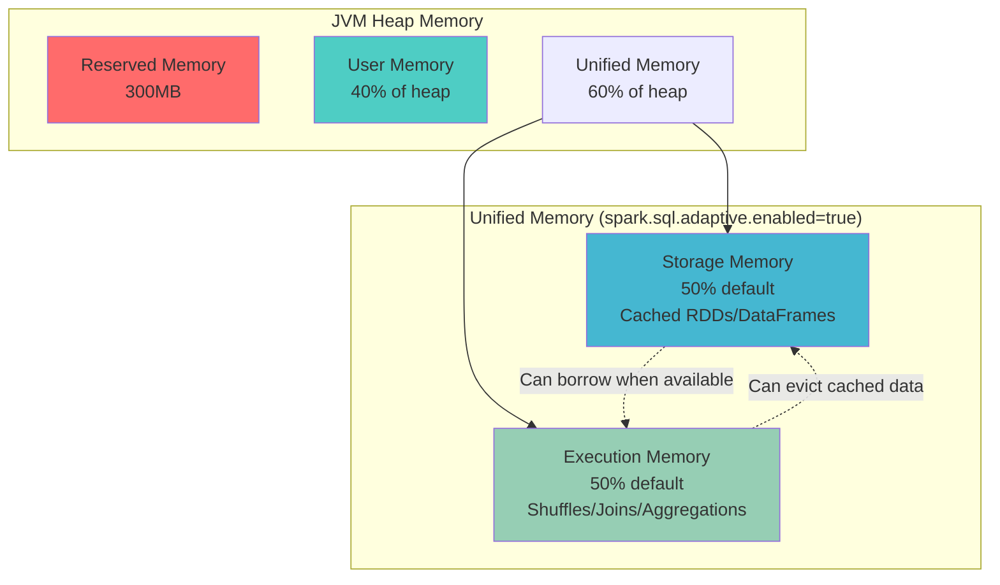

# Apache Spark Memory Management & Performance Tuning at Scale 🔧

## Subtitle: Master memory allocation, GC tuning, and cost-performance optimization for production Spark workloads

**Tags**: apache-spark, pyspark, memory-management, performance-tuning, cost-optimization, garbage-collection, caching, production

---

## TL;DR 🎯

- **Memory Model Mastery**: Understand Spark's unified memory manager and how storage/execution memory interact to prevent OOM failures
- **GC Optimization**: Implement garbage collection tuning strategies that can reduce job runtime by 20-40% in large-scale workloads  
- **Caching Intelligence**: Apply strategic caching and broadcast variables to minimize shuffle operations and network overhead
- **Cost Control**: Use resource allocation patterns and monitoring techniques to optimize cluster costs while maintaining SLAs
- **Production Hardening**: Implement observability and testing patterns that catch memory issues before they impact production pipelines

---

## Who This Is For + Prerequisites 👥

**Target Audience**: Data engineers running production Spark workloads who need to optimize performance and control costs at scale.

**Prerequisites**: 
- Experience with PySpark DataFrame operations and basic Spark architecture concepts
- Understanding of distributed computing fundamentals (covered in Part 1 & 2 of this series)
- Access to a Spark cluster for testing (local mode sufficient for examples)

---

## Learning Objectives 🎓

- **Memory Architecture**: Master Spark's unified memory model and its impact on job performance
- **Resource Allocation**: Configure driver and executor resources for optimal cost-performance balance
- **Garbage Collection**: Implement GC tuning strategies for large-heap, long-running Spark jobs
- **Caching Strategies**: Apply intelligent caching patterns to minimize data movement and computation
- **Monitoring & Observability**: Set up comprehensive monitoring to detect and prevent memory-related failures
- **Cost Optimization**: Use spot instances, auto-scaling, and resource right-sizing to minimize infrastructure spend

---

## Table of Contents 📋

1. [Spark Memory Model: The Foundation](#spark-memory-model-the-foundation-)
2. [Resource Allocation Strategy](#resource-allocation-strategy-)
3. [Garbage Collection Tuning](#garbage-collection-tuning-)
4. [Caching & Broadcast Optimization](#caching--broadcast-optimization-)
5. [Performance Monitoring & Observability](#performance-monitoring--observability-)
6. [Cost Optimization Techniques](#cost-optimization-techniques-)
7. [Production Checklist](#production-checklist-)

---

## Spark Memory Model: The Foundation 🧠

### Concept and Mental Model

Think of Spark memory like a dynamic office building where space is shared between two departments: **Storage** (long-term file cabinets) and **Execution** (temporary work desks). The building manager (Unified Memory Manager) can reassign space based on current needs, but there are rules about minimum allocations and eviction policies.

### Architecture Overview



*Caption: Spark's unified memory management dynamically balances storage and execution needs*  
*Alt: Diagram showing JVM heap split into reserved, user, and unified memory sections*

### Why It Matters in Real Pipelines

Memory mismanagement is the #1 cause of Spark job failures in production. Poor memory allocation leads to:

- **OutOfMemoryError**: Job failures requiring manual intervention and data reprocessing
- **Excessive Spill**: 10x slower performance when execution memory overflows to disk
- **Resource Waste**: Over-provisioning memory increases cloud costs by 30-50%
- **Unpredictable SLAs**: Memory pressure causes inconsistent job runtimes

### Implementation: Memory Configuration

```python
from pyspark.sql import SparkSession
from pyspark.conf import SparkConf

def create_optimized_spark_session():
    """Create Spark session with memory-optimized configuration"""
    
    conf = SparkConf()
    
    # Memory allocation (adjust based on your cluster)
    conf.set("spark.executor.memory", "8g")
    conf.set("spark.executor.memoryFraction", "0.6")  # Deprecated in 2.x but shown for reference
    conf.set("spark.sql.adaptive.enabled", "true")
    conf.set("spark.sql.adaptive.coalescePartitions.enabled", "true")
    
    # Unified memory tuning
    conf.set("spark.memory.fraction", "0.6")  # 60% for unified memory
    conf.set("spark.memory.storageFraction", "0.5")  # 50% of unified for storage
    
    # Serialization optimization
    conf.set("spark.serializer", "org.apache.spark.serializer.KryoSerializer")
    conf.set("spark.kryo.registrationRequired", "false")
    
    # Off-heap memory for shuffle operations
    conf.set("spark.memory.offHeap.enabled", "true")
    conf.set("spark.memory.offHeap.size", "2g")
    
    return SparkSession.builder \
        .appName("MemoryOptimizedApp") \
        .config(conf=conf) \
        .getOrCreate()

# Usage example
spark = create_optimized_spark_session()
```

---

## Resource Allocation Strategy ⚖️

### Right-Sizing Executors

The "fat executor" vs "thin executor" debate has a clear winner in production: **medium-sized executors** (4-8 cores, 16-32GB RAM) provide the best balance.

```python
def calculate_optimal_resources(total_cores, total_memory_gb, num_nodes):
    """
    Calculate optimal Spark resource allocation
    
    Args:
        total_cores: Total available cores in cluster
        total_memory_gb: Total available memory in GB
        num_nodes: Number of worker nodes
    
    Returns:
        dict: Recommended configuration
    """
    
    # Reserve 1 core and 1GB per node for OS/Hadoop daemons
    usable_cores = total_cores - num_nodes
    usable_memory = total_memory_gb - num_nodes
    
    # Target 4-6 cores per executor for optimal parallelism
    cores_per_executor = min(6, max(4, usable_cores // (num_nodes * 2)))
    
    # Calculate executors per node
    executors_per_node = usable_cores // (num_nodes * cores_per_executor)
    
    # Memory per executor (leave 10% overhead for JVM)
    memory_per_executor = int((usable_memory / (num_nodes * executors_per_node)) * 0.9)
    
    return {
        "spark.executor.cores": cores_per_executor,
        "spark.executor.memory": f"{memory_per_executor}g",
        "spark.executor.instances": num_nodes * executors_per_node,
        "spark.executor.memoryOverhead": f"{int(memory_per_executor * 0.1)}g",
        "spark.dynamicAllocation.enabled": "true",
        "spark.dynamicAllocation.minExecutors": "1",
        "spark.dynamicAllocation.maxExecutors": str(num_nodes * executors_per_node),
    }

# Example: 10-node cluster with 32 cores, 128GB each
config = calculate_optimal_resources(
    total_cores=320, 
    total_memory_gb=1280, 
    num_nodes=10
)
print(config)
# Output: 5 cores, 23g memory, 20 executors recommended
```

### Example: Processing Large Retail Transaction Dataset

```python
# Sample data creation for testing
def create_sample_transaction_data(spark, num_records=1_000_000):
    """Create sample retail transaction data for memory testing"""
    
    from pyspark.sql import functions as F
    from pyspark.sql.types import *
    
    # Create synthetic transaction data
    schema = StructType([
        StructField("transaction_id", StringType(), True),
        StructField("customer_id", StringType(), True),
        StructField("product_id", StringType(), True),
        StructField("amount", DecimalType(10,2), True),
        StructField("transaction_date", DateType(), True),
        StructField("store_id", StringType(), True)
    ])
    
    # Generate data using SQL for better memory control
    df = spark.sql(f"""
        SELECT 
            concat('txn_', cast(rand()*{num_records} as int)) as transaction_id,
            concat('cust_', cast(rand()*100000 as int)) as customer_id,
            concat('prod_', cast(rand()*10000 as int)) as product_id,
            cast(rand()*1000 as decimal(10,2)) as amount,
            date_add('2024-01-01', cast(rand()*365 as int)) as transaction_date,
            concat('store_', cast(rand()*500 as int)) as store_id
        FROM range({num_records})
    """)
    
    return df

# Memory-efficient aggregation example
def analyze_customer_patterns(df):
    """Analyze customer purchase patterns with memory optimization"""
    
    # Use broadcast hint for small lookup tables
    store_mapping = spark.sql("""
        SELECT concat('store_', id) as store_id, 
               case when id % 4 = 0 then 'Urban'
                    when id % 4 = 1 then 'Suburban' 
                    else 'Rural' end as store_type
        FROM range(500)
    """).hint("broadcast")
    
    # Efficient aggregation with pre-filtering and caching
    result = df \
        .filter(F.col("amount") > 10) \
        .cache() \
        .join(store_mapping, "store_id") \
        .groupBy("customer_id", "store_type") \
        .agg(
            F.sum("amount").alias("total_spent"),
            F.count("*").alias("transaction_count"),
            F.avg("amount").alias("avg_transaction")
        ) \
        .filter(F.col("total_spent") > 1000)
    
    return result

# Usage with memory monitoring
transactions = create_sample_transaction_data(spark, 5_000_000)
customer_analysis = analyze_customer_patterns(transactions)
customer_analysis.write.mode("overwrite").parquet("s3://your-bucket/customer_analysis/")
```

---

## Garbage Collection Tuning 🗑️

### The GC Challenge in Spark

Large Spark applications can have executors with 32GB+ heaps. Default JVM GC settings cause frequent "stop-the-world" pauses that can halt entire job execution for seconds.

### G1GC Configuration for Spark

```bash
# Recommended G1GC settings for Spark executors
export SPARK_EXECUTOR_OPTS="
  -XX:+UseG1GC
  -XX:G1HeapRegionSize=32m
  -XX:+UseStringDeduplication  
  -XX:MaxGCPauseMillis=200
  -XX:G1NewSizePercent=20
  -XX:G1MaxNewSizePercent=40
  -XX:InitiatingHeapOccupancyPercent=35
  -XX:+PrintGC
  -XX:+PrintGCDetails
  -XX:+PrintGCTimeStamps
  -XX:+UseCompressedOops
"
```

### PySpark GC Configuration

```python
def create_gc_optimized_session():
    """Create Spark session with GC-optimized configuration"""
    
    conf = SparkConf()
    
    # G1GC configuration for executors
    gc_opts = [
        "-XX:+UseG1GC",
        "-XX:G1HeapRegionSize=32m", 
        "-XX:+UseStringDeduplication",
        "-XX:MaxGCPauseMillis=200",
        "-XX:G1NewSizePercent=20",
        "-XX:G1MaxNewSizePercent=40",
        "-XX:InitiatingHeapOccupancyPercent=35",
        "-XX:+PrintGCDetails",
        "-XX:+UseCompressedOops"
    ]
    
    conf.set("spark.executor.extraJavaOptions", " ".join(gc_opts))
    
    # Driver GC (smaller heap, different strategy)
    driver_gc = [
        "-XX:+UseParallelGC",
        "-XX:ParallelGCThreads=4"
    ]
    conf.set("spark.driver.extraJavaOptions", " ".join(driver_gc))
    
    return SparkSession.builder.config(conf=conf).getOrCreate()
```

---

## Caching & Broadcast Optimization 📡

### Strategic Caching Patterns

Not all data should be cached. Cache strategically based on reuse patterns and memory pressure.

```python
from pyspark.storagelevel import StorageLevel

def implement_intelligent_caching(df, reuse_count_threshold=3):
    """
    Apply caching based on DataFrame characteristics and usage patterns
    
    Args:
        df: Input DataFrame
        reuse_count_threshold: Minimum expected reuses to justify caching
    
    Returns:
        Cached DataFrame with appropriate storage level
    """
    
    # Estimate DataFrame size (rough approximation)
    sample_size = df.sample(0.001).count()
    estimated_rows = sample_size * 1000 if sample_size > 0 else df.count()
    
    # Choose storage level based on size and reuse pattern
    if estimated_rows < 1_000_000:  # Small datasets
        storage_level = StorageLevel.MEMORY_ONLY
    elif estimated_rows < 10_000_000:  # Medium datasets  
        storage_level = StorageLevel.MEMORY_AND_DISK_SER
    else:  # Large datasets
        storage_level = StorageLevel.DISK_ONLY
    
    return df.persist(storage_level)

# Example: Multi-stage pipeline with strategic caching
def process_sales_pipeline(spark):
    """Production pipeline with optimized caching strategy"""
    
    # Read large transaction log (don't cache raw data)
    transactions = spark.read.parquet("s3://data-lake/transactions/")
    
    # Heavy transformation - cache the result for reuse
    enriched_transactions = transactions \
        .join(spark.table("dim_products"), "product_id") \
        .join(spark.table("dim_customers"), "customer_id") \
        .withColumn("profit_margin", F.col("sale_price") - F.col("cost")) \
        .filter(F.col("transaction_date") >= "2024-01-01")
    
    # Cache after expensive joins, before multiple aggregations
    cached_enriched = implement_intelligent_caching(enriched_transactions, reuse_count=4)
    
    # Multiple downstream operations benefit from cache
    daily_sales = cached_enriched.groupBy("transaction_date").agg(F.sum("amount"))
    monthly_profit = cached_enriched.groupBy("year_month").agg(F.sum("profit_margin")) 
    customer_segments = cached_enriched.groupBy("customer_segment").agg(F.avg("amount"))
    
    # Write results
    daily_sales.write.mode("overwrite").parquet("s3://reports/daily_sales/")
    monthly_profit.write.mode("overwrite").parquet("s3://reports/monthly_profit/")
    customer_segments.write.mode("overwrite").parquet("s3://reports/segments/")
    
    # Unpersist when done to free memory
    cached_enriched.unpersist()
    
    return daily_sales, monthly_profit, customer_segments
```

### Broadcast Variable Optimization

```python
def optimize_with_broadcast(spark):
    """Example of effective broadcast variable usage"""
    
    # Small lookup table - perfect for broadcasting
    product_categories = spark.sql("""
        SELECT product_id, category, subcategory, brand
        FROM dim_products 
        WHERE is_active = true
    """).collect()  # < 100MB, good broadcast candidate
    
    # Broadcast the lookup data
    broadcast_products = spark.sparkContext.broadcast(
        {row['product_id']: row.asDict() for row in product_categories}
    )
    
    def enrich_with_product_info(partition):
        """UDF to enrich transactions with broadcast product data"""
        product_lookup = broadcast_products.value
        
        for row in partition:
            product_info = product_lookup.get(row.product_id, {})
            yield {
                **row.asDict(),
                'category': product_info.get('category', 'Unknown'),
                'brand': product_info.get('brand', 'Unknown')
            }
    
    # Apply enrichment using broadcast variable
    transactions = spark.read.parquet("s3://transactions/")
    enriched = transactions.mapPartitions(enrich_with_product_info)
    
    return enriched

# Alternative: Broadcast hint for small DataFrames  
def broadcast_join_example(large_df, small_df):
    """Use broadcast hint for small table joins"""
    
    from pyspark.sql.functions import broadcast
    
    # Explicit broadcast hint (use when small_df < 200MB)
    result = large_df.join(
        broadcast(small_df), 
        "join_key"
    )
    
    return result
```

---

## Performance Monitoring & Observability 📊

### Comprehensive Memory Monitoring

```python
def setup_memory_monitoring(spark):
    """Configure comprehensive memory and performance monitoring"""
    
    # Enable detailed metrics collection
    conf_updates = {
        "spark.sql.adaptive.enabled": "true",
        "spark.sql.adaptive.coalescePartitions.enabled": "true", 
        "spark.serializer": "org.apache.spark.serializer.KryoSerializer",
        
        # Memory monitoring
        "spark.executor.processTreeMetrics.enabled": "true",
        "spark.executor.memory.samplingPeriodMs": "1000",
        
        # Performance metrics  
        "spark.sql.adaptive.advisoryPartitionSizeInBytes": "128MB",
        "spark.sql.shuffle.partitions": "200",
        
        # Event logging for analysis
        "spark.eventLog.enabled": "true",
        "spark.eventLog.dir": "s3://spark-logs/",
        "spark.history.fs.logDirectory": "s3://spark-logs/"
    }
    
    for key, value in conf_updates.items():
        spark.conf.set(key, value)
    
    return spark

def memory_usage_report(spark):
    """Generate memory usage report for current application"""
    
    # Get Spark context for low-level metrics
    sc = spark.sparkContext
    
    # Memory usage summary
    memory_status = sc.getExecutorMemoryStatus()
    
    total_memory = sum(status[0] for status in memory_status.values())
    used_memory = sum(status[1] for status in memory_status.values()) 
    
    print(f"Cluster Memory Summary:")
    print(f"  Total Available: {total_memory / (1024**3):.2f} GB")
    print(f"  Currently Used: {used_memory / (1024**3):.2f} GB")
    print(f"  Utilization: {(used_memory/total_memory)*100:.1f}%")
    
    # Per-executor breakdown
    print("\nPer-Executor Memory Usage:")
    for executor_id, (max_mem, used_mem) in memory_status.items():
        utilization = (used_mem / max_mem) * 100
        print(f"  Executor {executor_id}: {utilization:.1f}% ({used_mem/(1024**2):.0f}MB / {max_mem/(1024**2):.0f}MB)")
    
    return {
        "total_memory_gb": total_memory / (1024**3),
        "used_memory_gb": used_memory / (1024**3), 
        "utilization_percent": (used_memory/total_memory)*100
    }

# Usage in production pipeline
spark = setup_memory_monitoring(spark)
```

### Real-time Performance Alerts

```python
def create_performance_alerts(spark):
    """Set up automated performance monitoring and alerting"""
    
    import time
    from datetime import datetime
    
    class SparkMonitor:
        def __init__(self, spark_session):
            self.spark = spark_session
            self.sc = spark_session.sparkContext
            self.alert_thresholds = {
                'memory_utilization': 85.0,  # Alert if > 85% memory used
                'gc_time_ratio': 10.0,        # Alert if GC > 10% of total time
                'task_failure_rate': 5.0      # Alert if > 5% task failure rate
            }
    
        def check_memory_pressure(self):
            """Check for memory pressure issues"""
            status = memory_usage_report(self.spark)
            
            if status['utilization_percent'] > self.alert_thresholds['memory_utilization']:
                return {
                    'alert_type': 'HIGH_MEMORY_USAGE',
                    'severity': 'WARNING',
                    'message': f"Memory utilization at {status['utilization_percent']:.1f}%",
                    'recommendation': 'Consider increasing executor memory or reducing batch size'
                }
            return None
            
        def check_task_performance(self):
            """Monitor task execution metrics"""
            # This would integrate with Spark metrics system
            # Simplified example - in production use Spark metrics APIs
            
            app_id = self.sc.applicationId
            
            # Placeholder for task metrics analysis
            # In production, parse Spark event logs or use metrics system
            mock_metrics = {
                'failed_tasks': 12,
                'total_tasks': 1000,
                'avg_task_duration': 45.2
            }
            
            failure_rate = (mock_metrics['failed_tasks'] / mock_metrics['total_tasks']) * 100
            
            if failure_rate > self.alert_thresholds['task_failure_rate']:
                return {
                    'alert_type': 'HIGH_TASK_FAILURE_RATE', 
                    'severity': 'CRITICAL',
                    'message': f"Task failure rate: {failure_rate:.1f}%",
                    'recommendation': 'Check for memory pressure, data skew, or resource constraints'
                }
            return None
    
        def monitor_pipeline(self, check_interval=60):
            """Run continuous monitoring with specified interval"""
            
            while True:
                alerts = []
                
                # Check various metrics
                memory_alert = self.check_memory_pressure()
                if memory_alert:
                    alerts.append(memory_alert)
                
                task_alert = self.check_task_performance()  
                if task_alert:
                    alerts.append(task_alert)
                
                # Send alerts (integrate with your alerting system)
                for alert in alerts:
                    self.send_alert(alert)
                
                time.sleep(check_interval)
        
        def send_alert(self, alert):
            """Send alert to monitoring system (implement based on your setup)"""
            timestamp = datetime.now().isoformat()
            print(f"[{timestamp}] SPARK ALERT: {alert}")
            
            # In production: send to Slack, PagerDuty, CloudWatch, etc.
            # Example integrations:
            # - AWS CloudWatch custom metrics
            # - Slack webhook notifications  
            # - Email alerts via SES
            # - PagerDuty incident creation

# Usage
monitor = SparkMonitor(spark)
# Run monitoring in background thread in production
```

---

## Cost Optimization Techniques 💰

### Spot Instance Strategy

```python
def configure_spot_instances(spark):
    """Configure Spark for cost-effective spot instance usage"""
    
    # Spot-friendly configuration
    spot_config = {
        # Enable dynamic allocation for spot resilience
        "spark.dynamicAllocation.enabled": "true",
        "spark.dynamicAllocation.minExecutors": "2",
        "spark.dynamicAllocation.maxExecutors": "100",
        "spark.dynamicAllocation.initialExecutors": "10",
        
        # Faster scaling for spot interruptions
        "spark.dynamicAllocation.executorIdleTimeout": "60s",
        "spark.dynamicAllocation.schedulerBacklogTimeout": "5s",
        
        # Checkpoint for fault tolerance
        "spark.sql.adaptive.enabled": "true",
        "spark.sql.adaptive.coalescePartitions.enabled": "true",
        
        # Speculation for slow/interrupted tasks
        "spark.speculation": "true", 
        "spark.speculation.multiplier": "2.0",
        "spark.speculation.quantile": "0.9"
    }
    
    for key, value in spot_config.items():
        spark.conf.set(key, value)
    
    return spark

def implement_checkpointing_strategy(spark, df, checkpoint_path):
    """Implement smart checkpointing for spot instance resilience"""
    
    # Configure reliable checkpointing
    spark.sparkContext.setCheckpointDir(checkpoint_path)
    
    def checkpoint_after_expensive_ops(df, operation_name):
        """Checkpoint DataFrame after expensive operations"""
        
        # Write intermediate results for fault tolerance
        temp_path = f"{checkpoint_path}/temp_{operation_name}_{int(time.time())}"
        
        try:
            # Cache in memory first, then persist to reliable storage
            df.cache()
            df.write.mode("overwrite").parquet(temp_path)
            
            # Read back from storage (now fault-tolerant)
            checkpointed_df = spark.read.parquet(temp_path)
            
            # Clean up cache to free memory
            df.unpersist()
            
            return checkpointed_df
            
        except Exception as e:
            print(f"Checkpointing failed for {operation_name}: {e}")
            return df  # Return original if checkpointing fails
    
    return checkpoint_after_expensive_ops

# Example: Production pipeline with spot instance optimization
def cost_optimized_pipeline(spark):
    """Production pipeline optimized for spot instances and cost control"""
    
    # Configure for spot instance resilience
    spark = configure_spot_instances(spark)
    
    # Set up checkpointing
    checkpoint_fn = implement_checkpointing_strategy(
        spark, 
        df=None, 
        checkpoint_path="s3://your-bucket/checkpoints/"
    )
    
    # Process data with strategic checkpoints
    raw_data = spark.read.parquet("s3://data-lake/raw/")
    
    # Expensive join operation - checkpoint after
    joined_data = raw_data.join(
        spark.table("large_dimension_table"), 
        "key"
    )
    joined_checkpointed = checkpoint_fn(joined_data, "after_join")
    
    # Complex aggregations - checkpoint after  
    aggregated = joined_checkpointed.groupBy("category").agg(
        F.sum("amount"), 
        F.count("*"),
        F.collect_list("subcategory")
    )
    final_checkpointed = checkpoint_fn(aggregated, "after_aggregation")
    
    # Write final results
    final_checkpointed.write \
        .mode("overwrite") \
        .option("compression", "snappy") \
        .parquet("s3://results/final_output/")
    
    return final_checkpointed
```

### Resource Right-Sizing

```python
def auto_tune_resources(spark, data_size_gb, complexity_factor=1.0):
    """
    Automatically calculate optimal resource allocation based on data characteristics
    
    Args:
        spark: Spark session
        data_size_gb: Size of input data in GB
        complexity_factor: Multiplier for complex operations (joins, aggregations)
    
    Returns:
        dict: Optimized configuration settings
    """
    
    # Base resource calculations
    base_memory_per_gb = 2.5  # GB of executor memory per GB of data
    base_cores_per_gb = 0.25   # CPU cores per GB of data
    
    # Apply complexity factor
    required_memory = data_size_gb * base_memory_per_gb * complexity_factor
    required_cores = max(4, int(data_size_gb * base_cores_per_gb * complexity_factor))
    
    # Calculate optimal executor configuration
    max_executor_memory = 32  # Max memory per executor for GC efficiency
    cores_per_executor = min(6, max(2, required_cores // 4))
    
    num_executors = max(2, int(required_cores / cores_per_executor))
    memory_per_executor = min(max_executor_memory, required_memory / num_executors)
    
    config = {
        "spark.executor.instances": str(num_executors),
        "spark.executor.cores": str(cores_per_executor), 
        "spark.executor.memory": f"{int(memory_per_executor)}g",
        "spark.executor.memoryOverhead": f"{int(memory_per_executor * 0.1)}g",
        
        # Dynamic scaling bounds
        "spark.dynamicAllocation.minExecutors": "1",
        "spark.dynamicAllocation.maxExecutors": str(num_executors * 2),
        "spark.dynamicAllocation.initialExecutors": str(max(2, num_executors // 2)),
        
        # Partition tuning based on data size
        "spark.sql.shuffle.partitions": str(max(200, data_size_gb * 10)),
        "spark.sql.adaptive.advisoryPartitionSizeInBytes": "128MB"
    }
    
    # Apply configuration
    for key, value in config.items():
        spark.conf.set(key, value)
    
    print(f"Auto-tuned for {data_size_gb}GB dataset:")
    print(f"  Executors: {num_executors} x {cores_per_executor} cores x {memory_per_executor}GB")
    print(f"  Total Resources: {num_executors * cores_per_executor} cores, {num_executors * memory_per_executor}GB memory")
    
    return config

# Example usage for different data sizes
small_job_config = auto_tune_resources(spark, data_size_gb=50, complexity_factor=0.8)
large_job_config = auto_tune_resources(spark, data_size_gb=500, complexity_factor=1.5)
```

---

## Production Checklist ✅

### Memory & Performance Validation

```python
def production_readiness_check(spark):
    """Comprehensive production readiness assessment"""
    
    checks = {}
    
    # 1. Memory Configuration Validation
    executor_memory = spark.conf.get("spark.executor.memory", "1g")
    memory_overhead = spark.conf.get("spark.executor.memoryOverhead", "0g")
    
    checks['memory_config'] = {
        'executor_memory': executor_memory,
        'overhead_configured': memory_overhead != "0g",
        'recommendation': "Ensure memory overhead is 10-20% of executor memory"
    }
    
    # 2. GC Configuration Check
    java_opts = spark.conf.get("spark.executor.extraJavaOptions", "")
    gc_enabled = "UseG1GC" in java_opts or "UseParallelGC" in java_opts
    
    checks['gc_tuning'] = {
        'gc_tuned': gc_enabled,
        'current_opts': java_opts,
        'recommendation': "Enable G1GC for large heaps (>8GB)"
    }
    
    # 3. Serialization Check
    serializer = spark.conf.get("spark.serializer", "default")
    kryo_enabled = "KryoSerializer" in serializer
    
    checks['serialization'] = {
        'kryo_enabled': kryo_enabled,
        'current_serializer': serializer,
        'recommendation': "Use KryoSerializer for better performance"
    }
    
    # 4. Dynamic Allocation Check
    dynamic_enabled = spark.conf.get("spark.dynamicAllocation.enabled", "false") == "true"
    
    checks['dynamic_allocation'] = {
        'enabled': dynamic_enabled,
        'recommendation': "Enable dynamic allocation for cost efficiency"
    }
    
    # 5. Adaptive Query Execution
    aqe_enabled = spark.conf.get("spark.sql.adaptive.enabled", "false") == "true"
    
    checks['adaptive_execution'] = {
        'enabled': aqe_enabled,
        'recommendation': "Enable AQE for automatic query optimization"
    }
    
    # Generate report
    print("=== PRODUCTION READINESS REPORT ===")
    for check_name, details in checks.items():
        print(f"\n{check_name.upper()}:")
        for key, value in details.items():
            print(f"  {key}: {value}")
    
    # Overall readiness score
    total_checks = len(checks)
    passed_checks = sum(1 for check in checks.values() 
                       if any(isinstance(v, bool) and v for v in check.values()))
    
    readiness_score = (passed_checks / total_checks) * 100
    print(f"\n=== OVERALL READINESS: {readiness_score:.0f}% ===")
    
    if readiness_score < 80:
        print("⚠️  Additional tuning recommended before production deployment")
    else:
        print("✅ Ready for production deployment")
    
    return checks, readiness_score

# Run production readiness check
readiness_report, score = production_readiness_check(spark)
```

### Essential Monitoring Metrics

| Metric Category | Key Metrics | Alert Thresholds | Impact |
|---|---|---|---|
| **Memory Usage** | Executor memory utilization, GC time ratio | >85%, >10% | OOM failures, performance degradation |
| **Task Performance** | Task failure rate, median task duration | >5%, >2x baseline | Job failures, SLA misses |  
| **Shuffle Operations** | Shuffle read/write volume, spill ratio | >50GB/hour, >20% | Network bottlenecks, disk I/O pressure |
| **Resource Utilization** | CPU utilization, executor idle time | <70%, >30% | Cost inefficiency, resource waste |
| **Data Skew** | Max task duration vs median | >5x difference | Hot spot bottlenecks, uneven processing |

---

## Best Practices & Trade-offs ⚖️

### Do's and Don'ts

**✅ DO:**
- Monitor executor memory utilization and tune garbage collection for heaps >8GB
- Use broadcast joins for tables <200MB to avoid shuffle operations  
- Cache DataFrames strategically only when reused 3+ times in the pipeline
- Enable dynamic allocation in cloud environments for cost optimization
- Set up automated alerting for memory pressure and task failure rates

**❌ DON'T:**
- Cache everything - it wastes memory and can cause OOM issues
- Use tiny executors (<2 cores) or massive executors (>8 cores) in production
- Ignore GC tuning for long-running applications with large heaps
- Run without memory overhead configuration (leads to container kills)
- Deploy without monitoring memory utilization and performance metrics

### Trade-offs Analysis

| Decision | Pros | Cons | When to Choose |
|---|---|---|---|
| **Large Executors (8GB+)** | Fewer JVM overhead, better for large joins | GC pauses, slower failure recovery | Data-intensive workloads, complex aggregations |
| **Small Executors (<4GB)** | Fast GC, quick recovery from failures | Higher overhead, more network traffic | Streaming workloads, frequent checkpointing |
| **Memory Caching** | Faster recomputation, reduced I/O | Memory pressure, potential OOM | Iterative algorithms, reused DataFrames |
| **Disk Caching** | Lower memory pressure, cost-effective | Slower access, I/O bottlenecks | Large datasets, memory-constrained environments |

---

## Security & Compliance 🔒

### Memory Security Considerations

```python
def configure_secure_memory_handling(spark):
    """Configure Spark for secure memory handling in compliance environments"""
    
    security_config = {
        # Encrypt spilled data 
        "spark.io.encryption.enabled": "true",
        "spark.io.encryption.keySizeBits": "256",
        
        # Secure shuffle operations
        "spark.shuffle.encryption.enabled": "true", 
        "spark.shuffle.service.enabled": "false",  # Disable for security
        
        # Memory cleanup
        "spark.cleaner.referenceTracking.cleanCheckpoints": "true",
        "spark.cleaner.periodicGC.interval": "30min",
        
        # Audit and logging
        "spark.eventLog.enabled": "true",
        "spark.eventLog.compress": "true",
        "spark.executor.processTreeMetrics.enabled": "true"
    }
    
    for key, value in security_config.items():
        spark.conf.set(key, value)
    
    return spark

def implement_pii_memory_handling(df):
    """Implement PII-safe memory handling patterns"""
    
    from pyspark.sql.functions import hash, sha2
    
    # Hash PII fields in memory to prevent exposure
    sensitive_columns = ['customer_ssn', 'credit_card', 'phone_number']
    
    for col in sensitive_columns:
        if col in df.columns:
            df = df.withColumn(f"{col}_hash", sha2(F.col(col), 256)) \
                   .drop(col)  # Remove original PII from memory
    
    # Ensure no caching of PII data
    df = df.localCheckpoint(eager=False)  # Break lineage without caching
    
    return df
```

---

## What's Next 🚀

In **Part 4: Production Deployment Patterns & Multi-Cloud Strategies**, we'll cover:

- **Multi-cloud deployment**: Comparing EMR, Dataproc, Databricks, and Kubernetes for Spark workloads
- **Auto-scaling strategies**: Implementing cost-effective scaling policies across cloud providers  
- **CI/CD pipelines**: Building robust deployment pipelines for Spark applications
- **Infrastructure-as-code**: Managing Spark clusters with Terraform and CloudFormation
- **Disaster recovery**: Implementing backup, recovery, and cross-region deployment strategies

**What to Read Next:**
- [Apache Spark Official Performance Tuning Guide](https://spark.apache.org/docs/latest/tuning.html)
- [Databricks Memory Management Best Practices](https://docs.databricks.com/optimizations/memory-management.html)  
- [AWS EMR Performance Tuning](https://docs.aws.amazon.com/emr/latest/ReleaseGuide/emr-spark-performance.html)
- [Google Cloud Dataproc Optimization](https://cloud.google.com/dataproc/docs/concepts/configuring-clusters/optimizing)
- [Kubernetes Spark Operator Documentation](https://googlecloudplatform.github.io/spark-on-k8s-operator/)

---

## Assumptions Made

1. **Cloud Environment**: Assumed deployment on major cloud providers (AWS, GCP, Azure) with access to managed services and object storage
2. **Data Scale**: Examples assume datasets in the 100GB-10TB range typical of enterprise data transformation workloads requiring memory optimization strategies
