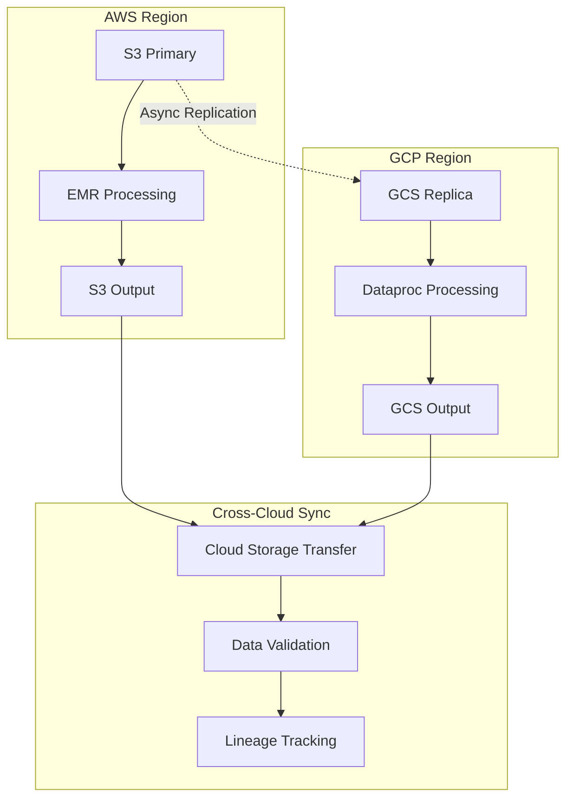

# Production Deployment Patterns & Multi-Cloud Strategies ☁️

## Navigate EMR, Dataproc, Databricks, and Kubernetes to optimize Spark costs and reliability across clouds

**Cover Image Suggestion**: Split-screen diagram showing Spark clusters deployed across AWS EMR, GCP Dataproc, and Azure Databricks with cost optimization indicators and auto-scaling patterns
**Tags**: apache-spark, pyspark, aws-emr, gcp-dataproc, databricks, kubernetes, multi-cloud, cost-optimization, production-deployment, infrastructure-as-code

---

## TL;DR 🎯

• **Platform Comparison**: Choose between EMR, Dataproc, Databricks, and Kubernetes based on cost, operational complexity, and feature requirements
• **Cost Optimization**: Implement spot instances, auto-scaling, and right-sizing strategies that can reduce infrastructure spend by 40-70%
• **Multi-Cloud Strategy**: Design portable deployment patterns that avoid vendor lock-in while leveraging cloud-specific optimizations
• **CI/CD Integration**: Build robust deployment pipelines with infrastructure-as-code, testing, and blue-green deployment patterns
• **Operational Excellence**: Establish monitoring, logging, and incident response patterns that minimize downtime and operational overhead

---

## Who This Is For + Prerequisites 👥

**Target Audience**: Platform engineers, DevOps engineers, and senior data engineers responsible for production Spark infrastructure and cost optimization.

**Prerequisites**: 
- Spark architecture and performance tuning knowledge (Parts 1-3 of this series)
- Cloud infrastructure experience with at least one major provider (AWS, GCP, Azure)
- Basic Kubernetes and containerization concepts
- Infrastructure-as-code tools (Terraform, CloudFormation, or similar)

---

## Learning Objectives 🎓

• **Platform Selection**: Apply decision frameworks to choose optimal Spark deployment platforms for specific workloads and constraints
• **Cost Engineering**: Implement advanced cost optimization techniques including spot instances, preemptible VMs, and dynamic scaling
• **Multi-Cloud Architecture**: Design portable Spark applications that can run efficiently across different cloud providers
• **Infrastructure Automation**: Build CI/CD pipelines with infrastructure-as-code that enable rapid, reliable deployments
• **Operational Monitoring**: Establish comprehensive observability across clusters, applications, and cost metrics
• **Security & Compliance**: Implement enterprise-grade security patterns including network isolation, encryption, and access controls

---

## Table of Contents 📚

1. [Mental Model: Infrastructure as a Strategic Asset 🧠](#mental-model)
2. [Platform Landscape: EMR vs Dataproc vs Databricks vs Kubernetes 🗺️](#platform-landscape)
3. [Cost Optimization Strategies Across Clouds 💰](#cost-optimization)
4. [Multi-Cloud Architecture Patterns 🌐](#multi-cloud-architecture)
5. [Infrastructure-as-Code Implementation 🛠️](#infrastructure-as-code)
6. [CI/CD Patterns for Spark Applications 🔄](#cicd-patterns)
7. [Monitoring & Observability at Scale 📊](#monitoring-observability)
8. [Security & Compliance Considerations 🔒](#security-compliance)
9. [Production Checklist ✅](#production-checklist)

---

## Mental Model: Infrastructure as a Strategic Asset 🧠

Think of Spark infrastructure like a manufacturing supply chain - you need the right balance of cost, reliability, and flexibility. Just as Toyota revolutionized manufacturing with just-in-time production, modern Spark deployments require dynamic resource allocation that matches workload patterns.

The key insight: **infrastructure decisions compound over time**. A 20% cost optimization achieved through smart deployment patterns can save millions annually for large-scale data operations.

### The Three Pillars of Production Spark Infrastructure

1. **Cost Efficiency**: Minimize spend while maintaining SLAs through spot instances, auto-scaling, and right-sizing
2. **Operational Simplicity**: Reduce maintenance overhead with managed services and automation
3. **Strategic Flexibility**: Avoid vendor lock-in while leveraging cloud-specific optimizations

```mermaid
C4Context
    title Multi-Cloud Spark Deployment Strategy - High Level Architecture

    Person(dataengineer, "Data Engineering Team", "Develops and deploys Spark applications")
    Person(platform, "Platform Team", "Manages infrastructure and cost optimization")
    
    System_Boundary(multi_cloud, "Multi-Cloud Spark Platform") {
        System(aws_stack, "AWS Stack", "EMR + S3 + Glue")
        System(gcp_stack, "GCP Stack", "Dataproc + GCS + BigQuery")
        System(azure_stack, "Azure Stack", "Databricks + ADLS + Synapse")
        System(k8s_stack, "Kubernetes", "Spark Operator + Storage CSI")
    }
    
    System_Boundary(shared_services, "Shared Services") {
        System(cicd, "CI/CD Pipeline", "GitLab/GitHub Actions with IaC")
        System(monitoring, "Observability", "Prometheus + Grafana + Datadog")
        System(cost_mgmt, "Cost Management", "CloudHealth + FinOps dashboards")
    }
    
    Rel(dataengineer, cicd, "Deploys applications via GitOps")
    Rel(platform, cost_mgmt, "Monitors and optimizes costs")
    Rel(cicd, multi_cloud, "Deploys to target environments")
    Rel(monitoring, multi_cloud, "Collects metrics and logs")
```
*Caption*: Multi-cloud Spark architecture enabling cost optimization and platform flexibility  
*Alt text*: Architecture diagram showing data engineering teams deploying through CI/CD to multiple cloud Spark platforms with shared monitoring and cost management

---

## Platform Landscape: EMR vs Dataproc vs Databricks vs Kubernetes 🗺️

### AWS EMR: The Pioneer 🏭

**Strengths:**
- Deep AWS service integration (S3, Glue, IAM, VPC)
- Mature spot instance integration with automatic recovery
- Extensive configuration flexibility and custom bootstrap actions
- Strong enterprise security with Lake Formation integration

**Weaknesses:**
- Slower innovation cycle compared to Databricks
- Complex cluster tuning and configuration management
- Limited collaborative features for data science teams
- Higher operational overhead for cluster lifecycle management

**Cost Profile:** 
- Base EMR charges: ~$0.27/hour per m5.xlarge + EC2 costs
- Spot instance savings: 60-80% for fault-tolerant workloads
- Storage: S3 costs + data transfer charges

**Best For:** Cost-sensitive workloads, heavy AWS integration, custom Spark configurations

### GCP Dataproc: The Simplicity Champion 🚄

**Strengths:**
- Fastest cluster startup times (30-90 seconds)
- Excellent BigQuery integration with native connectors
- Transparent per-second billing with automatic cluster deletion
- Strong Kubernetes integration with Dataproc on GKE

**Weaknesses:**
- Smaller ecosystem compared to AWS/Databricks
- Limited advanced features for data science workflows
- Fewer third-party integrations and marketplace offerings

**Cost Profile:**
- Dataproc charges: ~$0.01/vCPU/hour + Compute Engine costs
- Preemptible VM savings: 60-80% with automatic replacement
- Storage: GCS costs (typically lower than S3)

**Best For:** Google Cloud-native stacks, fast iteration cycles, cost-conscious teams

### Databricks: The Innovation Leader 🚀

**Strengths:**
- Best-in-class collaborative notebooks and MLflow integration
- Advanced auto-scaling and cluster optimization features
- Delta Lake native integration with ACID transactions
- Excellent data science and ML ecosystem

**Weaknesses:**
- Highest total cost of ownership across platforms
- Vendor lock-in with proprietary features and formats
- Complex pricing model with multiple cost components

**Cost Profile:**
- DBU (Databricks Unit) pricing: $0.40-0.99/DBU/hour depending on tier
- Cloud compute costs on top of DBU charges
- Premium features require higher-tier subscriptions

**Best For:** Data science teams, advanced analytics, organizations prioritizing time-to-value over cost

### Kubernetes: The Future Platform 🌟

**Strengths:**
- True cloud portability with consistent APIs
- Native integration with modern DevOps toolchains
- Fine-grained resource control and multi-tenancy
- Rapidly improving Spark Operator ecosystem

**Weaknesses:**
- Highest operational complexity and learning curve
- Limited managed service benefits (security patches, upgrades)
- Debugging distributed applications requires Kubernetes expertise

**Cost Profile:**
- Managed Kubernetes fees: $0.10/hour/cluster (EKS/GKE/AKS)
- Direct compute costs without markup
- Storage and networking typically less expensive

**Best For:** Multi-cloud strategies, container-native organizations, advanced DevOps teams

### Decision Matrix 🎯

| Factor | EMR | Dataproc | Databricks | Kubernetes |
|--------|-----|----------|------------|-------------|
| **Cost Optimization** | ⭐⭐⭐⭐ | ⭐⭐⭐⭐⭐ | ⭐⭐ | ⭐⭐⭐⭐ |
| **Operational Simplicity** | ⭐⭐ | ⭐⭐⭐⭐ | ⭐⭐⭐⭐⭐ | ⭐ |
| **Feature Richness** | ⭐⭐⭐ | ⭐⭐ | ⭐⭐⭐⭐⭐ | ⭐⭐⭐ |
| **Cloud Portability** | ⭐ | ⭐ | ⭐⭐ | ⭐⭐⭐⭐⭐ |
| **Enterprise Security** | ⭐⭐⭐⭐⭐ | ⭐⭐⭐⭐ | ⭐⭐⭐⭐ | ⭐⭐⭐ |

---

## Cost Optimization Strategies Across Clouds 💰

### Spot/Preemptible Instance Mastery 📉

The single most impactful cost optimization technique is leveraging spot instances effectively. Here's a battle-tested approach:

```python
# EMR Spot Instance Configuration
emr_spot_config = {
    "InstanceGroups": [
        {
            "Name": "Driver",
            "InstanceRole": "MASTER",
            "InstanceType": "m5.xlarge",
            "InstanceCount": 1,
            "Market": "ON_DEMAND"  # Driver should always be on-demand
        },
        {
            "Name": "Core",
            "InstanceRole": "CORE", 
            "InstanceType": "m5.2xlarge",
            "InstanceCount": 2,
            "Market": "ON_DEMAND"  # Core nodes for reliability
        },
        {
            "Name": "Task",
            "InstanceRole": "TASK",
            "InstanceType": "m5.4xlarge", 
            "InstanceCount": 10,
            "Market": "SPOT",
            "BidPrice": "0.30"  # 70% of on-demand price
        }
    ]
}

# Dataproc Preemptible Configuration
dataproc_config = {
    "preemptibleWorkerConfig": {
        "numInstances": 8,
        "machineTypeUri": "n1-standard-4",
        "diskConfig": {
            "bootDiskSizeGb": 100,
            "numLocalSsds": 1
        }
    },
    "secondaryWorkerConfig": {
        "numInstances": 0,  # Use preemptible as primary workers
        "isPreemptible": True
    }
}
```

### Auto-Scaling Patterns That Actually Work 📈

```python
# Intelligent auto-scaling based on queue depth
def configure_auto_scaling():
    return {
        "autoScaling": {
            "minCapacity": 2,
            "maxCapacity": 50,
            "targetMetrics": [
                {
                    "type": "QueueDepth",
                    "threshold": 10,
                    "scaleOutCooldown": "5m",
                    "scaleInCooldown": "15m"
                },
                {
                    "type": "CPUUtilization", 
                    "threshold": 70,
                    "evaluation_periods": 3
                }
            ]
        }
    }

# Cost-aware instance selection
def select_optimal_instances(workload_type, budget_constraint):
    """
    Select instances based on compute/memory ratio and cost efficiency
    """
    if workload_type == "cpu_intensive":
        return {
            "aws": ["c5.2xlarge", "c5.4xlarge"],
            "gcp": ["c2-standard-8", "c2-standard-16"], 
            "azure": ["F8s_v2", "F16s_v2"]
        }
    elif workload_type == "memory_intensive":
        return {
            "aws": ["r5.2xlarge", "r5.4xlarge"],
            "gcp": ["n1-highmem-8", "n1-highmem-16"],
            "azure": ["E8s_v3", "E16s_v3"]
        }
```

### Cost Monitoring and Alerting 🚨

```python
# Cost anomaly detection
def setup_cost_alerts():
    return {
        "daily_spend_threshold": 500,  # USD
        "weekly_trend_deviation": 25,  # percentage
        "resource_utilization_minimum": 60,  # percentage
        "alert_channels": ["slack", "pagerduty", "email"]
    }

# Real-time cost tracking
def track_job_costs(spark_context, job_config):
    """
    Track costs in real-time and implement circuit breakers
    """
    start_time = time.time()
    estimated_hourly_cost = calculate_cluster_cost(job_config)
    
    # Circuit breaker for runaway jobs
    max_runtime_hours = job_config.get("max_runtime", 4)
    max_cost = estimated_hourly_cost * max_runtime_hours
    
    if estimated_hourly_cost > job_config.get("cost_threshold", 100):
        spark_context.addSparkListener(CostTrackingListener(max_cost))
```

---

## Multi-Cloud Architecture Patterns 🌐

### Portable Application Design 🔄

The key to multi-cloud success is designing applications that abstract away cloud-specific details:

```python
# Cloud-agnostic storage interface
class CloudStorage:
    def __init__(self, provider, config):
        self.provider = provider
        self.config = config
        
    def read_data(self, path):
        if self.provider == "aws":
            return spark.read.option("path", f"s3a://{path}").load()
        elif self.provider == "gcp": 
            return spark.read.option("path", f"gs://{path}").load()
        elif self.provider == "azure":
            return spark.read.option("path", f"abfss://{path}").load()
            
    def write_data(self, df, path, mode="overwrite"):
        if self.provider == "aws":
            df.write.mode(mode).option("path", f"s3a://{path}").save()
        # ... other providers

# Environment-specific configuration
cloud_configs = {
    "aws": {
        "spark.hadoop.fs.s3a.impl": "org.apache.hadoop.fs.s3a.S3AFileSystem",
        "spark.hadoop.fs.s3a.aws.credentials.provider": "IAMInstanceProfile",
        "spark.sql.adaptive.enabled": "true",
        "spark.sql.adaptive.coalescePartitions.enabled": "true"
    },
    "gcp": {
        "spark.hadoop.fs.gs.impl": "com.google.cloud.hadoop.fs.gcs.GoogleHadoopFileSystem",
        "spark.hadoop.google.cloud.auth.service.account.enable": "true",
        "spark.sql.adaptive.enabled": "true"
    },
    "azure": {
        "spark.hadoop.fs.azure.account.auth.type": "OAuth",
        "spark.hadoop.fs.azure.account.oauth.provider.type": "ClientCredentials"
    }
}
```

### Cross-Cloud Data Replication Strategy 🔄


*Caption*: Cross-cloud data replication with validation and lineage tracking  
*Alt text*: Data flow diagram showing replication between AWS S3 and GCP GCS with validation steps

---

## Infrastructure-as-Code Implementation 🛠️

### Terraform Multi-Cloud Module 🏗️

```hcl
# modules/spark-cluster/main.tf
variable "cloud_provider" {
  type = string
  validation {
    condition = contains(["aws", "gcp", "azure"], var.cloud_provider)
    error_message = "Cloud provider must be aws, gcp, or azure."
  }
}

variable "cluster_config" {
  type = object({
    name = string
    min_nodes = number
    max_nodes = number
    instance_type = string
    spot_enabled = bool
    auto_scaling = bool
  })
}

# AWS EMR Module
module "emr_cluster" {
  count = var.cloud_provider == "aws" ? 1 : 0
  source = "./aws-emr"
  
  cluster_name = var.cluster_config.name
  instance_groups = [
    {
      name = "master"
      instance_role = "MASTER"
      instance_type = "m5.xlarge"
      instance_count = 1
      market = "ON_DEMAND"
    },
    {
      name = "core"
      instance_role = "CORE"
      instance_type = var.cluster_config.instance_type
      instance_count = var.cluster_config.min_nodes
      market = var.cluster_config.spot_enabled ? "SPOT" : "ON_DEMAND"
    }
  ]
  
  auto_scaling_policy = var.cluster_config.auto_scaling ? {
    constraints = {
      min_capacity = var.cluster_config.min_nodes
      max_capacity = var.cluster_config.max_nodes
    }
    rules = [
      {
        name = "ScaleOutMemoryPercentage"
        description = "Scale out based on memory usage"
        action = {
          simple_scaling_policy_configuration = {
            adjustment_type = "CHANGE_IN_CAPACITY"
            scaling_adjustment = 2
            cool_down = 300
          }
        }
        trigger = {
          cloud_watch_alarm_definition = {
            comparison_operator = "GREATER_THAN"
            evaluation_periods = 2
            metric_name = "MemoryPercentage"
            period = 300
            threshold = 75
          }
        }
      }
    ]
  } : null
}

# GCP Dataproc Module  
module "dataproc_cluster" {
  count = var.cloud_provider == "gcp" ? 1 : 0
  source = "./gcp-dataproc"
  
  cluster_name = var.cluster_config.name
  
  cluster_config = {
    preemptible_worker_config = var.cluster_config.spot_enabled ? {
      num_instances = var.cluster_config.max_nodes - var.cluster_config.min_nodes
      machine_type = var.cluster_config.instance_type
    } : null
    
    worker_config = {
      num_instances = var.cluster_config.min_nodes
      machine_type = var.cluster_config.instance_type
    }
  }
}
```

### GitOps Deployment Pipeline 🚀

```yaml
# .github/workflows/deploy-spark-infrastructure.yml
name: Deploy Spark Infrastructure

on:
  push:
    branches: [main]
    paths: ['infrastructure/**']
  pull_request:
    paths: ['infrastructure/**']

jobs:
  plan:
    runs-on: ubuntu-latest
    strategy:
      matrix:
        environment: [dev, staging, prod]
        cloud: [aws, gcp]
    
    steps:
    - uses: actions/checkout@v3
    
    - name: Setup Terraform
      uses: hashicorp/setup-terraform@v2
      with:
        terraform_version: 1.5.0
        
    - name: Configure Cloud Credentials
      run: |
        if [[ "${{ matrix.cloud }}" == "aws" ]]; then
          echo "AWS_ACCESS_KEY_ID=${{ secrets.AWS_ACCESS_KEY_ID }}" >> $GITHUB_ENV
          echo "AWS_SECRET_ACCESS_KEY=${{ secrets.AWS_SECRET_ACCESS_KEY }}" >> $GITHUB_ENV
        elif [[ "${{ matrix.cloud }}" == "gcp" ]]; then
          echo '${{ secrets.GCP_SA_KEY }}' > gcp-key.json
          echo "GOOGLE_APPLICATION_CREDENTIALS=gcp-key.json" >> $GITHUB_ENV
        fi
    
    - name: Terraform Plan
      run: |
        cd infrastructure/environments/${{ matrix.environment }}
        terraform init -backend-config="bucket=tfstate-${{ matrix.cloud }}-${{ matrix.environment }}"
        terraform plan -var="cloud_provider=${{ matrix.cloud }}" -out=tfplan
        
    - name: Cost Estimation
      uses: infracost/actions/setup@v2
      with:
        api-key: ${{ secrets.INFRACOST_API_KEY }}
    
    - name: Generate Cost Report
      run: |
        infracost breakdown --path=infrastructure/environments/${{ matrix.environment }} \
          --terraform-var="cloud_provider=${{ matrix.cloud }}" \
          --format=json --out-file=cost-estimate.json
          
    - name: Post Cost Comment
      if: github.event_name == 'pull_request'
      uses: infracost/actions/comment@v1
      with:
        path: cost-estimate.json
        behavior: update

  deploy:
    needs: plan
    runs-on: ubuntu-latest
    if: github.ref == 'refs/heads/main'
    
    steps:
    - name: Terraform Apply
      run: |
        cd infrastructure/environments/${{ matrix.environment }}
        terraform apply -auto-approve tfplan
        
    - name: Integration Tests
      run: |
        python tests/integration/test_spark_cluster.py \
          --cloud=${{ matrix.cloud }} \
          --environment=${{ matrix.environment }}
```

---

## CI/CD Patterns for Spark Applications 🔄

### Application Deployment Pipeline 📦

```python
# deployment/spark_deployer.py
class SparkApplicationDeployer:
    def __init__(self, cloud_provider, environment):
        self.cloud_provider = cloud_provider
        self.environment = environment
        self.config = self._load_config()
    
    def deploy_application(self, app_config):
        """
        Deploy Spark application with environment-specific configurations
        """
        # Validate application
        self._validate_application(app_config)
        
        # Package dependencies
        package_path = self._package_application(app_config)
        
        # Upload to cloud storage
        storage_path = self._upload_package(package_path)
        
        # Submit to cluster
        job_id = self._submit_job(app_config, storage_path)
        
        # Monitor deployment
        self._monitor_deployment(job_id)
        
        return job_id
    
    def _submit_job(self, app_config, package_path):
        if self.cloud_provider == "aws":
            return self._submit_emr_job(app_config, package_path)
        elif self.cloud_provider == "gcp":
            return self._submit_dataproc_job(app_config, package_path)
        elif self.cloud_provider == "databricks":
            return self._submit_databricks_job(app_config, package_path)
    
    def _submit_emr_job(self, app_config, package_path):
        import boto3
        
        emr = boto3.client('emr')
        
        step = {
            'Name': app_config['name'],
            'ActionOnFailure': 'TERMINATE_CLUSTER',
            'HadoopJarStep': {
                'Jar': 'command-runner.jar',
                'Args': [
                    'spark-submit',
                    '--class', app_config['main_class'],
                    '--conf', f'spark.app.name={app_config["name"]}',
                    '--conf', 'spark.sql.adaptive.enabled=true',
                    '--conf', 'spark.sql.adaptive.coalescePartitions.enabled=true',
                    package_path
                ] + app_config.get('args', [])
            }
        }
        
        response = emr.add_job_flow_steps(
            JobFlowId=self.config['cluster_id'],
            Steps=[step]
        )
        
        return response['StepIds'][0]
```

### Blue-Green Deployment Strategy 🔵🟢

```yaml
# kubernetes/spark-operator-deployment.yml
apiVersion: sparkoperator.k8s.io/v1beta2
kind: SparkApplication
metadata:
  name: data-pipeline-blue
  namespace: spark-jobs
spec:
  type: Python
  mode: cluster
  image: "your-registry/spark-app:v1.2.3"
  imagePullPolicy: Always
  mainApplicationFile: "s3a://your-bucket/jobs/data_pipeline.py"
  
  sparkVersion: "3.4.0"
  
  restartPolicy:
    type: OnFailure
    onFailureRetries: 3
    onFailureRetryInterval: 10
    onSubmissionFailureRetries: 5
    onSubmissionFailureRetryInterval: 20
  
  driver:
    cores: 2
    coreLimit: "2000m"
    memory: "4g"
    serviceAccount: spark-driver
    env:
      - name: ENVIRONMENT
        value: "production"
    
  executor:
    cores: 4
    instances: 10
    memory: "8g"
    serviceAccount: spark-executor
    
  monitoring:
    exposeDriverMetrics: true
    exposeExecutorMetrics: true
    prometheus:
      jmxExporterJar: "/prometheus/jmx_prometheus_javaagent-0.17.0.jar"
      port: 8090

---
apiVersion: v1
kind: Service  
metadata:
  name: data-pipeline-service
spec:
  selector:
    app: data-pipeline
    version: blue  # Switch to green during deployment
  ports:
    - port: 4040
      targetPort: 4040
```

---

## Monitoring & Observability at Scale 📊

### Comprehensive Metrics Collection 📈

```python
# monitoring/spark_metrics.py
class SparkMetricsCollector:
    def __init__(self, prometheus_gateway, cloud_provider):
        self.prometheus_gateway = prometheus_gateway
        self.cloud_provider = cloud_provider
        
    def collect_cluster_metrics(self, cluster_id):
        """
        Collect cluster-level metrics across different platforms
        """
        metrics = {}
        
        if self.cloud_provider == "aws":
            metrics.update(self._collect_emr_metrics(cluster_id))
        elif self.cloud_provider == "gcp":
            metrics.update(self._collect_dataproc_metrics(cluster_id))
        elif self.cloud_provider == "databricks":
            metrics.update(self._collect_databricks_metrics(cluster_id))
            
        # Send to Prometheus
        self._send_to_prometheus(metrics)
        
        return metrics
    
    def _collect_emr_metrics(self, cluster_id):
        import boto3
        
        cloudwatch = boto3.client('cloudwatch')
        emr = boto3.client('emr')
        
        # Get cluster details
        cluster = emr.describe_cluster(ClusterId=cluster_id)
        
        # Collect CloudWatch metrics
        metrics = {}
        metric_queries = [
            ('CPUUtilization', 'AWS/EMR', 'JobFlowId'),
            ('HDFSUtilization', 'AWS/EMR', 'JobFlowId'),
            ('MemoryPercentage', 'AWS/EMR', 'JobFlowId'),
            ('ContainerPending', 'AWS/EMR', 'JobFlowId')
        ]
        
        for metric_name, namespace, dimension_name in metric_queries:
            response = cloudwatch.get_metric_statistics(
                Namespace=namespace,
                MetricName=metric_name,
                Dimensions=[{'Name': dimension_name, 'Value': cluster_id}],
                StartTime=datetime.utcnow() - timedelta(minutes=10),
                EndTime=datetime.utcnow(),
                Period=300,
                Statistics=['Average', 'Maximum']
            )
            
            if response['Datapoints']:
                latest = max(response['Datapoints'], key=lambda x: x['Timestamp'])
                metrics[f'emr_{metric_name.lower()}'] = latest['Average']
        
        return metrics

# Grafana Dashboard Configuration
grafana_dashboard = {
    "dashboard": {
        "title": "Multi-Cloud Spark Operations",
        "panels": [
            {
                "title": "Cluster CPU Utilization",
                "type": "graph",
                "targets": [
                    {
                        "expr": "avg(spark_cluster_cpu_utilization) by (cloud_provider, cluster_id)",
                        "legendFormat": "{{cloud_provider}} - {{cluster_id}}"
                    }
                ]
            },
            {
                "title": "Cost per Hour by Cloud Provider", 
                "type": "stat",
                "targets": [
                    {
                        "expr": "sum(spark_cluster_cost_per_hour) by (cloud_provider)",
                        "legendFormat": "{{cloud_provider}}"
                    }
                ]
            },
            {
                "title": "Job Success Rate",
                "type": "singlestat", 
                "targets": [
                    {
                        "expr": "rate(spark_job_success_total[5m]) / rate(spark_job_total[5m])",
                        "legendFormat": "Success Rate"
                    }
                ]
            }
        ]
    }
}
```

### Alerting Rules for Production 🚨

```yaml
# monitoring/prometheus-rules.yml
groups:
- name: spark-cluster-alerts
  rules:
  - alert: SparkClusterHighCPU
    expr: avg(spark_cluster_cpu_utilization) by (cluster_id) > 85
    for: 10m
    labels:
      severity: warning
      team: data-platform
    annotations:
      summary: "Spark cluster {{ $labels.cluster_id }} has high CPU usage"
      description: "CPU utilization is {{ $value }}% for cluster {{ $labels.cluster_id }}"
      runbook_url: "https://wiki.company.com/spark-troubleshooting#high-cpu"

  - alert: SparkJobFailureRate
    expr: rate(spark_job_failures_total[15m]) / rate(spark_job_total[15m]) > 0.1
    for: 5m
    labels:
      severity: critical
      team: data-platform
    annotations:
      summary: "High Spark job failure rate detected"
      description: "Job failure rate is {{ $value | humanizePercentage }} over the last 15 minutes"

  - alert: SparkCostAnomaly
    expr: increase(spark_cluster_cost_usd[1h]) > 200
    for: 15m
    labels:
      severity: warning
      team: finops
    annotations:
      summary: "Spark cluster cost anomaly detected"
      description: "Hourly cost increase of ${{ $value }} detected for cluster {{ $labels.cluster_id }}"

  - alert: SparkClusterUnhealthy
    expr: up{job="spark-cluster"} == 0
    for: 5m
    labels:
      severity: critical
      team: data-platform
    annotations:
      summary: "Spark cluster is down"
      description: "Cluster {{ $labels.cluster_id }} is not responding to health checks"
```

---

## Security & Compliance Considerations 🔒

### Multi-Layer Security Implementation 🛡️

```python
# security/spark_security_config.py
class SparkSecurityConfig:
    def __init__(self, environment, compliance_requirements):
        self.environment = environment
        self.compliance_requirements = compliance_requirements
    
    def get_security_config(self):
        """
        Generate security configuration based on compliance requirements
        """
        config = {
            # Encryption at rest and in transit
            "spark.ssl.enabled": "true",
            "spark.ssl.keyStore": "/etc/spark/ssl/spark-keystore.jks",
            "spark.ssl.keyStorePassword": "${SPARK_SSL_KEYSTORE_PASSWORD}",
            "spark.ssl.trustStore": "/etc/spark/ssl/spark-truststore.jks", 
            "spark.ssl.trustStorePassword": "${SPARK_SSL_TRUSTSTORE_PASSWORD}",
            
            # Network security
            "spark.network.crypto.enabled": "true",
            "spark.network.crypto.keyLength": "256",
            "spark.authenticate": "true",
            "spark.authenticate.secret": "${SPARK_AUTH_SECRET}",
            
            # RBAC and access controls
            "spark.acls.enable": "true",
            "spark.admin.acls": "admin-group",
            "spark.modify.acls": "data-engineering-group",
            "spark.view.acls": "data-analyst-group",
            
            # Audit logging
            "spark.eventLog.enabled": "true",
            "spark.eventLog.dir": self._get_audit_log_path(),
            "spark.history.fs.logDirectory": self._get_audit_log_path(),
            
            # Data masking for PII
            "spark.sql.adaptive.enabled": "true",
            "spark.sql.adaptive.localShuffleReader.enabled": "true"
        }
        
        # Add compliance-specific configurations
        if "GDPR" in self.compliance_requirements:
            config.update(self._get_gdpr_config())
        if "HIPAA" in self.compliance_requirements:
            config.update(self._get_hipaa_config())
        if "SOX" in self.compliance_requirements:
            config.update(self._get_sox_config())
            
        return config
    
    def _get_gdpr_config(self):
        """GDPR-specific configurations"""
        return {
            "spark.sql.execution.arrow.pyspark.enabled": "true",
            "spark.serializer": "org.apache.spark.serializer.KryoSerializer",
            # Enable column-level encryption for PII
            "spark.sql.extensions": "io.delta.sql.DeltaSparkSessionExtension",
            "spark.sql.catalog.spark_catalog": "org.apache.spark.sql.delta.catalog.DeltaCatalog"
        }
    
    def setup_data_classification(self, spark_session):
        """
        Implement data classification and PII detection
        """
        # Register UDFs for data classification
        from pyspark.sql.functions import udf, col, when
        from pyspark.sql.types import StringType
        import re
        
        @udf(returnType=StringType())
        def classify_pii(value):
            if not value:
                return "PUBLIC"
            
            # Email detection
            if re.match(r'^[a-zA-Z0-9._%+-]+@[a-zA-Z0-9.-]+\.[a-zA-Z]{2,}$', value):
                return "PII_EMAIL"
            
            # SSN detection (US format)
            if re.match(r'^\d{3}-?\d{2}-?\d{4}$', value):
                return "PII_SSN"
            
            # Credit card detection (basic)
            if re.match(r'^\d{4}[\s-]?\d{4}[\s-]?\d{4}[\s-]?\d{4}$', value):
                return "PII_CREDIT_CARD"
            
            return "PUBLIC"
        
        spark_session.udf.register("classify_pii", classify_pii)
        
        # Create data classification table
        spark_session.sql("""
            CREATE OR REPLACE TEMPORARY VIEW data_classification AS
            SELECT 
                table_name,
                column_name,
                classify_pii(sample_value) as classification_level,
                CASE 
                    WHEN classify_pii(sample_value) LIKE 'PII_%' THEN true
                    ELSE false
                END as requires_encryption
            FROM information_schema.columns
        """)
```

### Network Security and VPC Configuration 🔐

```hcl
# security/network-security.tf
resource "aws_vpc" "spark_vpc" {
  cidr_block           = "10.0.0.0/16"
  enable_dns_hostnames = true
  enable_dns_support   = true
  
  tags = {
    Name = "spark-secure-vpc"
    Environment = var.environment
    Compliance = "SOC2,PCI-DSS"
  }
}

resource "aws_subnet" "spark_private_subnets" {
  count = length(var.availability_zones)
  
  vpc_id            = aws_vpc.spark_vpc.id
  cidr_block        = "10.0.${count.index + 1}.0/24"
  availability_zone = var.availability_zones[count.index]
  
  tags = {
    Name = "spark-private-${count.index + 1}"
    Type = "Private"
  }
}

# NAT Gateway for outbound internet access
resource "aws_nat_gateway" "spark_nat" {
  count = length(aws_subnet.spark_private_subnets)
  
  allocation_id = aws_eip.nat_eip[count.index].id
  subnet_id     = aws_subnet.spark_public_subnets[count.index].id
  
  tags = {
    Name = "spark-nat-${count.index + 1}"
  }
}

# Security groups with least privilege
resource "aws_security_group" "spark_driver" {
  name_prefix = "spark-driver-${var.environment}"
  vpc_id      = aws_vpc.spark_vpc.id
  
  # Allow inbound from executors only
  ingress {
    from_port       = 7077
    to_port         = 7077
    protocol        = "tcp"
    security_groups = [aws_security_group.spark_executor.id]
  }
  
  # Allow Spark UI from specific CIDR blocks only
  ingress {
    from_port   = 4040
    to_port     = 4040
    protocol    = "tcp"
    cidr_blocks = var.admin_cidr_blocks
  }
  
  # Outbound to executors and external services
  egress {
    from_port       = 0
    to_port         = 65535
    protocol        = "tcp"
    security_groups = [aws_security_group.spark_executor.id]
  }
  
  tags = {
    Name = "spark-driver-sg"
    Environment = var.environment
  }
}

resource "aws_security_group" "spark_executor" {
  name_prefix = "spark-executor-${var.environment}"
  vpc_id      = aws_vpc.spark_vpc.id
  
  # Allow inbound from driver only
  ingress {
    from_port       = 7078
    to_port         = 7088
    protocol        = "tcp"
    security_groups = [aws_security_group.spark_driver.id]
  }
  
  # Allow executor-to-executor communication
  ingress {
    from_port = 7078
    to_port   = 7088  
    protocol  = "tcp"
    self      = true
  }
  
  tags = {
    Name = "spark-executor-sg"
    Environment = var.environment
  }
}
```

---

## Production Checklist ✅

### Pre-Deployment Validation 🔍

- [ ] **Resource Sizing**: Validated cluster sizing with production data volumes
- [ ] **Cost Estimation**: Reviewed cost projections and set up budget alerts
- [ ] **Security Review**: Completed security assessment for compliance requirements
- [ ] **Network Configuration**: Verified VPC, security groups, and network policies
- [ ] **Backup Strategy**: Implemented data backup and disaster recovery procedures
- [ ] **Monitoring Setup**: Configured metrics collection, dashboards, and alerting
- [ ] **Load Testing**: Performed load testing with representative workloads
- [ ] **Failover Testing**: Validated cluster auto-recovery and job retry mechanisms

### Operational Readiness 🚀

- [ ] **Documentation**: Created runbooks for common operational scenarios
- [ ] **Access Controls**: Configured RBAC and service accounts with least privilege
- [ ] **Incident Response**: Established on-call procedures and escalation paths
- [ ] **Change Management**: Implemented CI/CD pipelines with proper approvals
- [ ] **Cost Controls**: Set up automated cost optimization and resource cleanup
- [ ] **Compliance Audit**: Completed compliance verification for regulatory requirements
- [ ] **Performance Baselines**: Established performance benchmarks and SLA definitions
- [ ] **Knowledge Transfer**: Trained operations team on troubleshooting procedures

### Post-Deployment Monitoring 📊

- [ ] **Health Checks**: Automated health monitoring across all environments
- [ ] **Performance Tracking**: Real-time performance metrics and trend analysis
- [ ] **Cost Optimization**: Continuous cost monitoring and optimization recommendations
- [ ] **Security Monitoring**: Security event monitoring and threat detection
- [ ] **Capacity Planning**: Resource utilization tracking and scaling recommendations
- [ ] **Compliance Reporting**: Automated compliance reporting and audit trails

---

## Recap and What's Next 🚀

In this deep dive into production Spark deployment patterns, we've covered the critical decisions and implementation patterns that separate successful production deployments from expensive experiments.

### Key Takeaways 🎯

1. **Platform selection is strategic**: Choose based on total cost of ownership, not just compute costs
2. **Cost optimization is ongoing**: Implement monitoring, alerting, and automation from day one
3. **Multi-cloud requires discipline**: Abstract cloud-specific details and invest in portability
4. **Security is foundational**: Design security controls into your architecture, don't bolt them on later
5. **Operations matter most**: The best architecture fails without proper monitoring and incident response

### What's Next in Part 5 🔮

Our final installment will explore advanced Spark features and enterprise integration patterns:

- **Structured Streaming**: Real-time processing patterns with exactly-once guarantees
- **Delta Lake Integration**: ACID transactions and schema evolution in production
- **Data Governance**: Lineage tracking, data quality, and compliance automation
- **Testing Strategies**: Unit, integration, and performance testing for Spark applications
- **Modern Data Stack Integration**: Connecting Spark with dbt, Airflow, and cloud data warehouses

---

## What to Read Next 📚

**Essential Resources:**
- [Apache Spark Official Documentation](https://spark.apache.org/docs/latest/)
- [AWS EMR Best Practices Guide](https://docs.aws.amazon.com/emr/latest/ManagementGuide/emr-plan.html)
- [GCP Dataproc Documentation](https://cloud.google.com/dataproc/docs)
- [Databricks Production Best Practices](https://docs.databricks.com/administration-guide/index.html)
- [Kubernetes Spark Operator](https://github.com/GoogleCloudPlatform/spark-on-k8s-operator)
- [Terraform AWS Provider](https://registry.terraform.io/providers/hashicorp/aws/latest/docs)

**Advanced Topics:**
- "Designing Data-Intensive Applications" by Martin Kleppmann
- "High Performance Spark" by Holden Karau and Rachel Warren

---

## Assumptions Made 📝

1. **Cloud Provider Access**: Assumed readers have access to at least one major cloud provider (AWS, GCP, or Azure) with appropriate permissions to create infrastructure resources.

2. **Infrastructure-as-Code Experience**: Assumed familiarity with infrastructure-as-code tools like Terraform or CloudFormation, though specific examples were provided for Terraform implementation patterns.

---

*Found this helpful? Share your multi-cloud Spark deployment experiences in the comments, and don't forget to follow for Part 5 where we'll dive into advanced streaming and enterprise integration patterns! 🚀*
